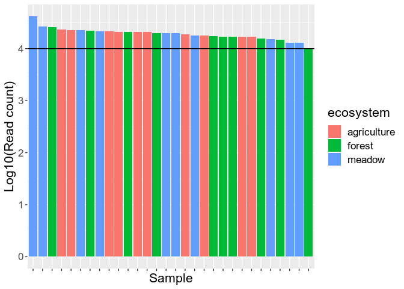
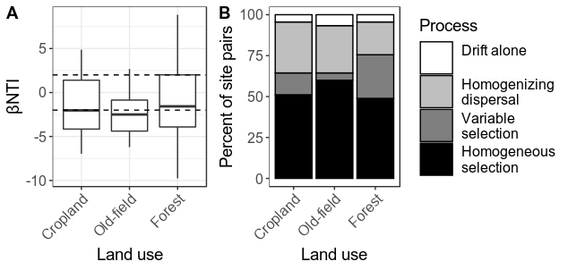
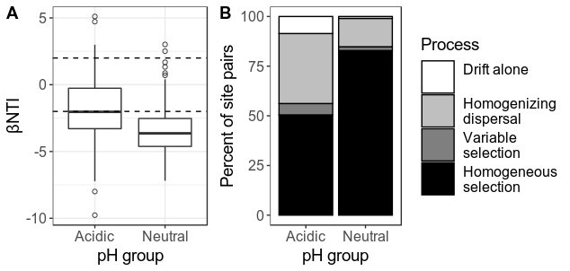
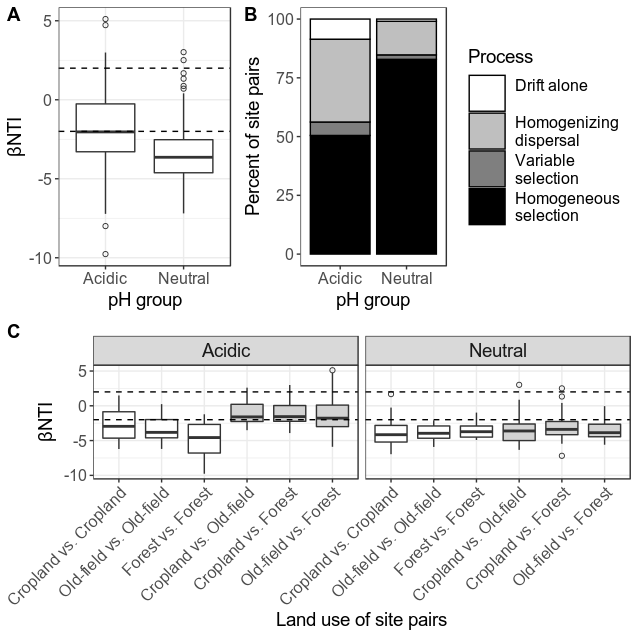

Relative influence of sochastic and deterministic processes on community
turnover
================
Samuel Barnett
06 December, 2019

## Introduction

In the following analysis we will be using both βNTI and RCbray to
examine the processes driving community assembly across land use regime
and pH groups. βNTI values were calculated in bNTI\_calculations.Rmd and
RCbray values are calculated here

This analysis values for significance testing as in Stegen et al. 2012
and Stegen et al. 2013. This means that the following conclusison can be
drawn from this data:

βNTI \> 2: Community assembly driven by variable selection βNTI \< -2:
Community assembly driven by homgenizing selection |βNTI| \< 2 & RCbray
\> 0.95: Community assembly driven by dispersal limitation |βNTI| \< 2 &
RCbray \< -0.95: Community assembly driven by homogenizing dispersal
|βNTI| \< 2 & |RCbray| \< 0.95: Community assembly is due to drift
alone (or weak selection)

Please note that some of these cell have eval=FALSE in the rmarkdown
version so that they wont run when knitted. This was done because they
take a really long time and are better run in terminal.

### Initiate libraries

``` r
# Packages needed for analysis
library(dplyr)
library(tibble)
library(phyloseq)
library(ape)
library(vegan)
library(parallel)

# Packages needed for plotting
library(ggplot2)
```

### Import data

``` r
# Import bulk soil phyloseq data
bulk.physeq = readRDS("/home/sam/data/fullCyc2_data/bulk_soil_physeq.RDS")

## Check how many reads you have in each of the samples. This will tell you if you need to re-do anything
# Get read counts and make a new dataframe with this data
read_count = data.frame("count" = colSums(otu_table(bulk.physeq))) %>%
  rownames_to_column(var="X.Sample") %>%
  inner_join(data.frame(sample_data(bulk.physeq)), by="X.Sample") %>%
  arrange(-count) %>%
  mutate(X.Sample=factor(X.Sample, levels=X.Sample))

# Now plot read count for each sample. The horizontal line represents a 2000 read threshold
ggplot(data=read_count, aes(x=X.Sample, y=log10(count), fill=ecosystem)) +
  geom_bar(stat="identity") +
  labs(x="Sample", y="Log10(Read count)") +
  geom_hline(yintercept=log10(10000)) +
  theme(text = element_text(size=16),
        axis.text.x = element_blank())
```

<!-- -->

``` r
# Everything seems to be at or above 10000 total reads

bulk.physeq
```

    ## phyloseq-class experiment-level object
    ## otu_table()   OTU Table:         [ 15112 taxa and 30 samples ]
    ## sample_data() Sample Data:       [ 30 samples by 30 sample variables ]
    ## tax_table()   Taxonomy Table:    [ 15112 taxa by 7 taxonomic ranks ]
    ## phy_tree()    Phylogenetic Tree: [ 15112 tips and 15111 internal nodes ]

Now we need to rarefy the data to normalize the sequencing depth. We
should also get a normalized dataset which gives relative abundance
rather than readcounts.

``` r
# Rarefy to an even depth
set.seed(72)  # setting seed for reproducibility
bulk.physeq.rare = rarefy_even_depth(bulk.physeq)

# Normalize read counts (this gives relative abundance)
bulk.physeq.norm = transform_sample_counts(bulk.physeq.rare, function(x) x/sum(x))
```

Now import the βNTI data generated in bNTI\_calculation.Rmd

``` r
# Import data
full.bNTI.df = read.table("/home/sam/data/fullCyc2_data/Final_data/community_assembly/full_bNTI.txt")
```

## Calculating RCbray

First we need a function to calculate RCbray.

``` r
# Function for calculating the distances in the null communities
RCbray_null_func <- function(i, freq.abd.df, alpha1, alpha2, N){
  # Get simulated communities and distance
  ## initally select OTUs weighted by their frequency. The number of OTUs selected should equal the richness of the samples.
  simcom1 = data.frame(table(sample(freq.abd.df$OTU, size=alpha1, replace=F, prob=freq.abd.df$freq)), stringsAsFactors = F)
  colnames(simcom1) = c("OTU","simcom1")
  simcom1$OTU = as.character(simcom1$OTU)
  simcom1 = inner_join(simcom1, freq.abd.df, by="OTU")
  simcom2 = data.frame(table(sample(freq.abd.df$OTU, size=alpha2, replace=F, prob=freq.abd.df$freq)), stringsAsFactors = F)
  colnames(simcom2) = c("OTU","simcom2")
  simcom2$OTU = as.character(simcom2$OTU)
  simcom2 = inner_join(simcom2, freq.abd.df, by="OTU")

  ## Now recruit OTUs based on their abundance in the metacommunity
  simcom1.abd = data.frame(table(sample(simcom1$OTU, size=N-alpha1, replace=T, prob=simcom1$p)), stringsAsFactors = F)
  colnames(simcom1.abd) = c("OTU","simcom1.abd")
  simcom1.abd$OTU = as.character(simcom1.abd$OTU)
  simcom1 = full_join(simcom1, simcom1.abd, by="OTU") %>%
    mutate(simcom1.abd = ifelse(is.na(simcom1.abd), 1, simcom1.abd)) %>%
    select(OTU, simcom1.abd)
  
  simcom2.abd = data.frame(table(sample(simcom2$OTU, size=N-alpha2, replace=T, prob=simcom2$p)), stringsAsFactors = F)
  colnames(simcom2.abd) = c("OTU","simcom2.abd")
  simcom2.abd$OTU = as.character(simcom2.abd$OTU)
  simcom2 = full_join(simcom2, simcom2.abd, by="OTU") %>%
    mutate(simcom2.abd = ifelse(is.na(simcom2.abd), 1, simcom2.abd)) %>%
    select(OTU, simcom2.abd)

  
  simcom = full_join(simcom1, simcom2, by="OTU")
  simcom[is.na(simcom)] = 0
  rownames(simcom) = simcom$OTU
  simcom$OTU = NULL
  
  null.dist = vegdist(t(simcom), method="bray")[1]
  return(null.dist)
}

# Main function for calculating RCbray
Calc_RCbray <- function(physeq, reps, nproc){
  # Get OTU table from phyloseq object
  otu.table = otu_table(physeq)
  
  # Get alpha diversity for each sample
  otu.PA.table = otu.table
  otu.PA.table[otu.PA.table > 0] = 1
  alpha.df = data.frame(Sample_ID = colnames(otu.PA.table), OTU.n = colSums(otu.PA.table), stringsAsFactors = F)
  
  # Get beta diversity matrix
  beta.table = as.matrix(vegdist(t(otu.PA.table), method="bray", diag=TRUE, upper=TRUE))
  
  ## Get metacommunity
  # Calculate the number of individuals in the meta community (Average read depth)
  N <- mean(apply(t(otu.table), 1, sum))
  
  # Calculate the average relative abundance of each taxa across communities
  p.m <- apply(t(otu.table), 2, mean)
  p.m <- p.m[p.m != 0]
  p <- p.m/N
  
  # Calculate the occurrence frequency of each taxa across communities
  otu.table.bi <- 1*(t(otu.table)>0)
  freq <- apply(otu.table.bi, 2, mean)
  freq <- freq[freq != 0]
  
  # Combine
  freq.abd.df = data.frame(p=p, freq=freq) %>%
    tibble::rownames_to_column(var="OTU") %>%
    filter(p != 0, freq != 0) %>%
    arrange(p)
  
  # For each pair of samples run the RCbray analysis
  comps = combn(alpha.df$Sample_ID, m=2, simplify = F)
  RCb.df = data.frame(Site1 = character(), Site2 = character(), RCb = numeric(), stringsAsFactors = F)
  for (j in seq(1, length(comps))){
    sam = comps[[j]]
    alpha1 = alpha.df[alpha.df$Sample_ID == sam[1],]$OTU.n
    alpha2 = alpha.df[alpha.df$Sample_ID == sam[2],]$OTU.n
    # Permute "reps" many times
    rep.list = seq(1, reps)
    null.list = mclapply(rep.list, RCbray_null_func, freq.abd.df=freq.abd.df, alpha1=alpha1, alpha2=alpha2, N=N, mc.cores=nproc)
    
    RCb = (length(null.list[null.list > beta.table[sam[1], sam[2]]]) + (0.5*length(null.list[null.list == beta.table[sam[1], sam[2]]])))/reps
    RCb = (RCb - 0.5)*2
    
    RCb.df = rbind(RCb.df, data.frame(Site1=sam[1], Site2=sam[2], RCb=RCb, stringsAsFactors = F))
  }
  
  RCb.df
  return(RCb.df)
}
```

Now calculate the RCbray for 999 bootstrap replicates for each site
pair. This should only be run once (eval=FALSE).

``` r
# Run the RCbray function
RCb.df = Calc_RCbray(bulk.physeq.rare, 999, 20)
write.table(RCb.df, file="/home/sam/fullCyc2_data/Final_data/community_assembly/full.RCb.df.txt", quote = F, sep = "\t")

writeLines("\n\n\n\n\nDone!!!\n\n\n\n\n")
```

## Merging βNTI and RCbray data

Now I’ll import both the βNTI data and the newly generated RCbray data.
Then add in land use categories.

``` r
# bNTI data
# Import bNTI data
bNTI.df = read.table("/home/sam/data/fullCyc2_data/Final_data/community_assembly/full_bNTI.txt")

# RCbray data
RCb.df = read.table(file="/home/sam/data/fullCyc2_data/Final_data/community_assembly/full.RCb.df.txt") %>%
  mutate(Sample_1 = Site2, Sample_2 = Site1)

# Get habitat metadata and add it to the βNTI then merge with the RCbray dataset
eco.meta1=data.frame(sample_data(bulk.physeq.rare)) %>%
  select(X.Sample, ecosystem) %>%
  rename(Sample_1 = X.Sample, ecosystem_1 = ecosystem)
eco.meta2=data.frame(sample_data(bulk.physeq.rare)) %>%
  select(X.Sample, ecosystem) %>%
  rename(Sample_2 = X.Sample, ecosystem_2 = ecosystem)

bNTI.df = inner_join(bNTI.df, eco.meta1) %>%
  inner_join(eco.meta2)
  

# Merge both datasets
turnover.df = inner_join(bNTI.df, RCb.df)
head(turnover.df)
```

    ##      Sample_1    Sample_2      bMNTD mean_bMNTD     sd_bMNTD      bNTI
    ## 1 EL.A.151026 CC.A.151027 0.02016516 0.02375343 0.0006834651 -5.250116
    ## 2 CF.A.151027 CC.A.151027 0.01910554 0.02356232 0.0006401618 -6.961971
    ## 3 EL.M.151026 CC.A.151027 0.03881704 0.04066696 0.0013836678 -1.336973
    ## 4 MF.F.151026 CC.A.151027 0.03210584 0.03561841 0.0015856144 -2.215275
    ## 5 MP.F.151026 CC.A.151027 0.01923891 0.02469787 0.0007593102 -7.189362
    ## 6 MW.M.151027 CC.A.151027 0.02239621 0.02642288 0.0007702880 -5.227487
    ##   ecosystem_1 ecosystem_2       Site1       Site2        RCb
    ## 1 agriculture agriculture CC.A.151027 EL.A.151026 -0.8538539
    ## 2 agriculture agriculture CC.A.151027 CF.A.151027 -0.8358358
    ## 3      meadow agriculture CC.A.151027 EL.M.151026 -1.0000000
    ## 4      forest agriculture CC.A.151027 MF.F.151026 -1.0000000
    ## 5      forest agriculture CC.A.151027 MP.F.151026 -0.9339339
    ## 6      meadow agriculture CC.A.151027 MW.M.151027 -0.9419419

## Community assembly processes across land use regime

Now lets combine the RCbray results with the results from the bNTI
analysis. This will tell us the relative influcence of both
deterministic (bNTI) and stochastic (RCbray) processes on community
turnover in each land use regime.

    ##    ecosystem2                process n_sites      perc
    ## 1    Cropland                  Drift       2  4.444444
    ## 2    Cropland Homogenizing Dispersal      14 31.111111
    ## 3    Cropland     Variable Selection       6 13.333333
    ## 4    Cropland  Homogeneous Selection      23 51.111111
    ## 5   Old-field                  Drift       3  6.666667
    ## 6   Old-field Homogenizing Dispersal      13 28.888889
    ## 7   Old-field     Variable Selection       2  4.444444
    ## 8   Old-field  Homogeneous Selection      27 60.000000
    ## 9      Forest                  Drift       2  4.444444
    ## 10     Forest Homogenizing Dispersal       9 20.000000
    ## 11     Forest     Variable Selection      12 26.666667
    ## 12     Forest  Homogeneous Selection      22 48.888889

<!-- -->

## Community assembly processes across pH group

Now lets look at the relative influcence of both deterministic (bNTI)
and stochastic (RCbray) processes on community turnover in each pH
group. Again acidic soils have a pH ≤ 5.5 and pH neutral soils have 5.5
\< pH \< 8.5. As we found in bNTI\_across\_pH\_groups.Rmd there is an
interaction between pH group and land use regime so we want to add that
to the figure too.

    ##   pH_group                process n_sites      perc
    ## 1   Acidic                  Drift       9  8.571429
    ## 2   Acidic Homogenizing Dispersal      37 35.238095
    ## 3   Acidic     Variable Selection       6  5.714286
    ## 4   Acidic  Homogeneous Selection      53 50.476190
    ## 5  Neutral                  Drift       1  0.952381
    ## 6  Neutral Homogenizing Dispersal      15 14.285714
    ## 7  Neutral     Variable Selection       2  1.904762
    ## 8  Neutral  Homogeneous Selection      87 82.857143

<!-- -->

Now add in the plot also generated in bNTI\_across\_pH\_groups.Rmd
showing the interaction between pH group and land use on
bNTI.

<!-- -->

## Session Info

``` r
sessionInfo()
```

    ## R version 3.4.4 (2018-03-15)
    ## Platform: x86_64-pc-linux-gnu (64-bit)
    ## Running under: Ubuntu 18.04.3 LTS
    ## 
    ## Matrix products: default
    ## BLAS: /usr/lib/x86_64-linux-gnu/blas/libblas.so.3.7.1
    ## LAPACK: /usr/lib/x86_64-linux-gnu/lapack/liblapack.so.3.7.1
    ## 
    ## locale:
    ##  [1] LC_CTYPE=en_US.UTF-8       LC_NUMERIC=C              
    ##  [3] LC_TIME=en_US.UTF-8        LC_COLLATE=en_US.UTF-8    
    ##  [5] LC_MONETARY=en_US.UTF-8    LC_MESSAGES=en_US.UTF-8   
    ##  [7] LC_PAPER=en_US.UTF-8       LC_NAME=C                 
    ##  [9] LC_ADDRESS=C               LC_TELEPHONE=C            
    ## [11] LC_MEASUREMENT=en_US.UTF-8 LC_IDENTIFICATION=C       
    ## 
    ## attached base packages:
    ## [1] parallel  stats     graphics  grDevices utils     datasets  methods  
    ## [8] base     
    ## 
    ## other attached packages:
    ## [1] ggplot2_3.2.1   vegan_2.5-6     lattice_0.20-38 permute_0.9-5  
    ## [5] ape_5.3         phyloseq_1.22.3 tibble_2.1.3    dplyr_0.8.3    
    ## 
    ## loaded via a namespace (and not attached):
    ##  [1] tidyselect_0.2.5    xfun_0.10           reshape2_1.4.3     
    ##  [4] purrr_0.3.2         splines_3.4.4       rhdf5_2.22.0       
    ##  [7] colorspace_1.4-1    htmltools_0.4.0     stats4_3.4.4       
    ## [10] mgcv_1.8-31         yaml_2.2.0          survival_3.1-7     
    ## [13] rlang_0.4.0         pillar_1.4.2        withr_2.1.2        
    ## [16] glue_1.3.1          BiocGenerics_0.24.0 foreach_1.4.7      
    ## [19] plyr_1.8.4          stringr_1.4.0       zlibbioc_1.24.0    
    ## [22] Biostrings_2.46.0   munsell_0.5.0       gtable_0.3.0       
    ## [25] codetools_0.2-16    evaluate_0.14       labeling_0.3       
    ## [28] Biobase_2.38.0      knitr_1.25          IRanges_2.12.0     
    ## [31] biomformat_1.6.0    Rcpp_1.0.2          scales_1.0.0       
    ## [34] S4Vectors_0.16.0    jsonlite_1.6        XVector_0.18.0     
    ## [37] digest_0.6.21       stringi_1.4.3       cowplot_0.9.2      
    ## [40] ade4_1.7-13         grid_3.4.4          tools_3.4.4        
    ## [43] magrittr_1.5        lazyeval_0.2.2      cluster_2.1.0      
    ## [46] crayon_1.3.4        pkgconfig_2.0.3     MASS_7.3-51.4      
    ## [49] Matrix_1.2-17       data.table_1.12.4   assertthat_0.2.1   
    ## [52] rmarkdown_1.16      iterators_1.0.12    R6_2.4.0           
    ## [55] multtest_2.34.0     igraph_1.2.4.1      nlme_3.1-142       
    ## [58] compiler_3.4.4
