Alpha and Beta diversity across habitat
================
Samuel Barnett
06 December, 2019

## Introduction

This notebook goes through the basic alpha and beta diveristy analysis.
This will also include analysis on abiotic drivers of bacterial
betadiversity with CAP analysis.

### Initiate libraries

``` r
# Packages needed for analysis
library(dplyr)
library(tibble)
library(phyloseq)
library(ape)
library(vegan)
library(FSA)

# Packages needed for plotting
library(ggplot2)
library(ggrepel)

# Function for pulling out legends
g_legend<-function(a.gplot){
  tmp <- ggplot_gtable(ggplot_build(a.gplot))
  leg <- which(sapply(tmp$grobs, function(x) x$name) == "guide-box")
  legend <- tmp$grobs[[leg]]
  return(legend)}
```

### Import data

``` r
# Import bulk soil phyloseq data
bulk.physeq = readRDS("/home/sam/data/fullCyc2_data/bulk_soil_physeq.RDS")

## Check how many reads you have in each of the samples. This will tell you if you need to re-do anything
# Get read counts and make a new dataframe with this data
read_count = data.frame("count" = colSums(otu_table(bulk.physeq))) %>%
  rownames_to_column(var="X.Sample") %>%
  inner_join(data.frame(sample_data(bulk.physeq)), by="X.Sample") %>%
  arrange(-count) %>%
  mutate(X.Sample=factor(X.Sample, levels=X.Sample))

# Now plot read count for each sample. The horizontal line represents a 2000 read threshold
ggplot(data=read_count, aes(x=X.Sample, y=log10(count), fill=ecosystem)) +
  geom_bar(stat="identity") +
  labs(x="Sample", y="Log10(Read count)") +
  geom_hline(yintercept=log10(10000)) +
  theme(text = element_text(size=16),
        axis.text.x = element_blank())
```

<!-- -->

``` r
# Everything seems to be at or above 10000 total reads

bulk.physeq
```

    ## phyloseq-class experiment-level object
    ## otu_table()   OTU Table:         [ 15112 taxa and 30 samples ]
    ## sample_data() Sample Data:       [ 30 samples by 30 sample variables ]
    ## tax_table()   Taxonomy Table:    [ 15112 taxa by 7 taxonomic ranks ]
    ## phy_tree()    Phylogenetic Tree: [ 15112 tips and 15111 internal nodes ]

All samples have over 10,000 reads except for one of the forest samples
that is just about at 10,000 reads, which is great. We don’t need to
remove any datasets for lack of sequences.

Now we need to rarefy the data to normalize the sequencing depth. We
should also get a normalized dataset which gives relative abundance
rather than readcounts.

``` r
# Rarefy to an even depth
set.seed(72)  # setting seed for reproducibility
bulk.physeq.rare = rarefy_even_depth(bulk.physeq)

# Normalize read counts (this gives relative abundance)
bulk.physeq.norm = transform_sample_counts(bulk.physeq.rare, function(x) x/sum(x))
```

## Alpha diversity

Lets look at the alpha diversity of between soil habitats and between
sites.

### Richness

First look at the number of unique OTUs in each sample across land use
regimes

    ## Kruskal-Wallis test:

    ## 
    ##  Kruskal-Wallis rank sum test
    ## 
    ## data:  count by ecosystem
    ## Kruskal-Wallis chi-squared = 8.2245, df = 2, p-value = 0.01637

    ## 
    ## There is a significant effect of sample type on OTU number. Now running Dunn test for pairwise comparisons:
    ##             Comparison          Z     P.unadj      P.adj
    ## 1 agriculture - forest  2.7686028 0.005629723 0.01688917
    ## 2 agriculture - meadow  2.0320020 0.042153450 0.06323018
    ## 3      forest - meadow -0.7366007 0.461365187 0.46136519

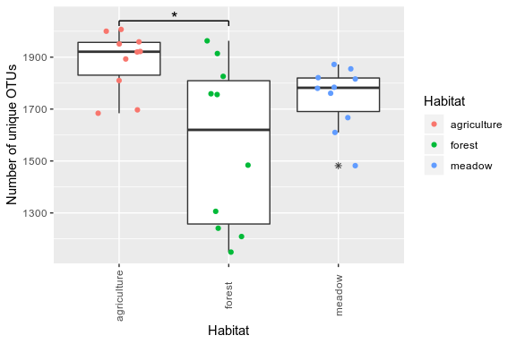<!-- -->

We see that the number of OTUs differs significantly by habitat, and
that this is driven by a significant differences between agriculture and
forest.

### Shannon index

Now I’ll look at Shannon index, which takes into account OTU abundance.

    ## Kruskal-Wallis test:

    ## 
    ##  Kruskal-Wallis rank sum test
    ## 
    ## data:  shannon by ecosystem
    ## Kruskal-Wallis chi-squared = 14, df = 2, p-value = 0.0009119

    ## 
    ## There is a significant effect of sample type on Shannon index. Now running Dunn test for pairwise comparisons:
    ##             Comparison         Z      P.unadj        P.adj
    ## 1 agriculture - forest  3.683004 0.0002305018 0.0006915055
    ## 2 agriculture - meadow  2.413002 0.0158217148 0.0237325722
    ## 3      forest - meadow -1.270001 0.2040841778 0.2040841778

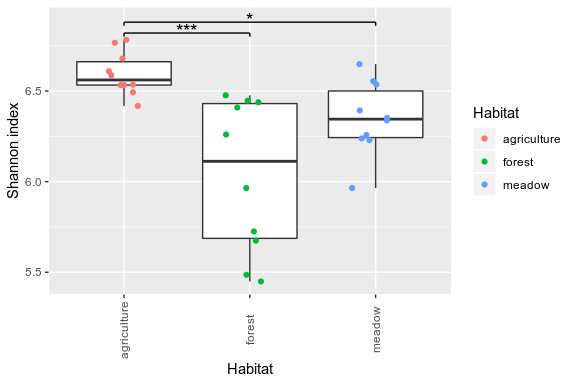<!-- -->

Again we see a significant difference in Shannon index between habitats.
This was driven by significant differences between agriculture and both
forest and meadow. Agriculture has the highest alpha diversity of the
three habitats.

### Plot alpha diversity plots together

Plot both richness and shannon diversity together for publication

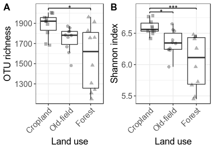<!-- -->

## Beta diveristy

Now lets look at the community composition across the region and how the
communities differ across land use regimes. There are a number of
different metrics to use but I will focus on weighted UniFrac. I will
also run a similar analysis with unweighted UniFrac and Bray-Curtis.

### Weighted UniFrac

#### Ordination

First lets plot the ordination showing the relation of our samples.

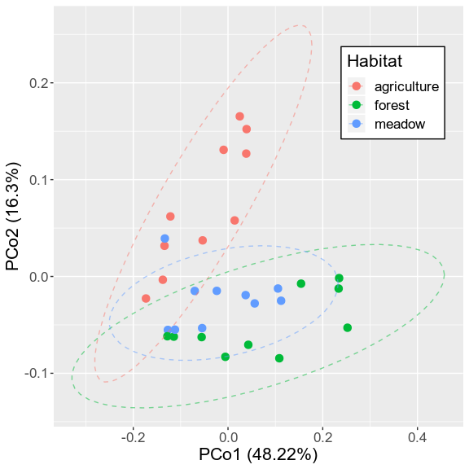<!-- -->

#### Permanova

Lets run a permanova analysis to see if land use significant explains
community compositional variation.

    ## 
    ## Call:
    ## adonis(formula = wuf.dist ~ ecosystem, data = metadata) 
    ## 
    ## Permutation: free
    ## Number of permutations: 999
    ## 
    ## Terms added sequentially (first to last)
    ## 
    ##           Df SumsOfSqs  MeanSqs F.Model      R2 Pr(>F)    
    ## ecosystem  2   0.18804 0.094020  3.7752 0.21853  0.001 ***
    ## Residuals 27   0.67242 0.024904         0.78147           
    ## Total     29   0.86046                  1.00000           
    ## ---
    ## Signif. codes:  0 '***' 0.001 '**' 0.01 '*' 0.05 '.' 0.1 ' ' 1

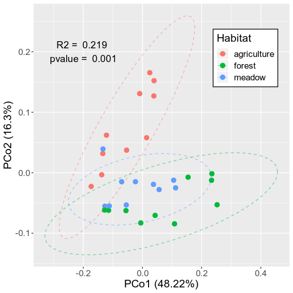<!-- -->

Land use significantly explains community compositional variation.

### Unweighted UniFrac.

For this analysis we will examine the microbial community composition
across land use using unweighted unifrac. This means that this analysis
will not take abundance into account.

#### Ordination

First lets plot the ordination showing the relation of our samples.

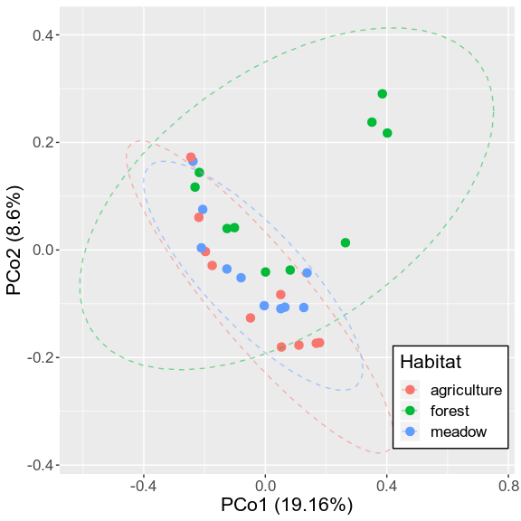<!-- -->

#### Permanova

Lets run a permanova analysis to see if land use significant explains
community compositional variation.

    ## 
    ## Call:
    ## adonis(formula = uf.dist ~ ecosystem, data = metadata) 
    ## 
    ## Permutation: free
    ## Number of permutations: 999
    ## 
    ## Terms added sequentially (first to last)
    ## 
    ##           Df SumsOfSqs MeanSqs F.Model     R2 Pr(>F)   
    ## ecosystem  2    0.6462 0.32312  1.7112 0.1125  0.003 **
    ## Residuals 27    5.0983 0.18882         0.8875          
    ## Total     29    5.7445                 1.0000          
    ## ---
    ## Signif. codes:  0 '***' 0.001 '**' 0.01 '*' 0.05 '.' 0.1 ' ' 1

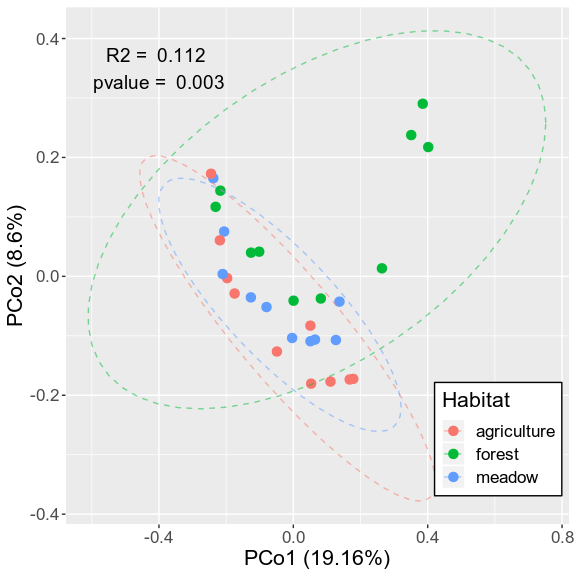<!-- -->

Again land use significantly explains community compositional variation.

### Bray-Curtis.

For this analysis we will examine the microbial community composition
across land use using Bray-Curtis dissimilarity. Unlike unifrac, this
analysis does not take into account the phylogeny of the OTUs

#### Ordination

First lets plot the ordination showing the relation of our samples.

    ## Run 0 stress 0.04742412 
    ## Run 1 stress 0.08817183 
    ## Run 2 stress 0.04812711 
    ## Run 3 stress 0.09315307 
    ## Run 4 stress 0.04812812 
    ## Run 5 stress 0.0988226 
    ## Run 6 stress 0.04742409 
    ## ... New best solution
    ## ... Procrustes: rmse 9.807793e-06  max resid 2.822695e-05 
    ## ... Similar to previous best
    ## Run 7 stress 0.1154568 
    ## Run 8 stress 0.1154328 
    ## Run 9 stress 0.1232978 
    ## Run 10 stress 0.04742428 
    ## ... Procrustes: rmse 4.610453e-05  max resid 0.0001498016 
    ## ... Similar to previous best
    ## Run 11 stress 0.04812754 
    ## Run 12 stress 0.04812703 
    ## Run 13 stress 0.04742399 
    ## ... New best solution
    ## ... Procrustes: rmse 3.336964e-05  max resid 0.0001085183 
    ## ... Similar to previous best
    ## Run 14 stress 0.09333985 
    ## Run 15 stress 0.04812738 
    ## Run 16 stress 0.04742431 
    ## ... Procrustes: rmse 0.0003603072  max resid 0.001305778 
    ## ... Similar to previous best
    ## Run 17 stress 0.04742463 
    ## ... Procrustes: rmse 0.0003786034  max resid 0.001361418 
    ## ... Similar to previous best
    ## Run 18 stress 0.1165602 
    ## Run 19 stress 0.1240595 
    ## Run 20 stress 0.381266 
    ## *** Solution reached

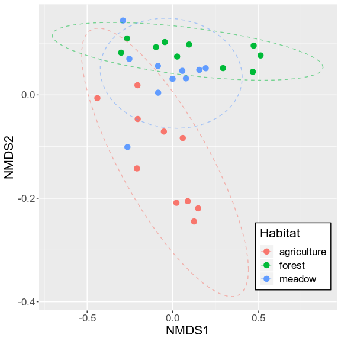<!-- -->

### Permanova

Lets run a permanova analysis to see if there are significant effects of
habitat on community composition.

    ## 
    ## Call:
    ## adonis(formula = bc.dist ~ ecosystem, data = metadata) 
    ## 
    ## Permutation: free
    ## Number of permutations: 999
    ## 
    ## Terms added sequentially (first to last)
    ## 
    ##           Df SumsOfSqs MeanSqs F.Model      R2 Pr(>F)    
    ## ecosystem  2    0.9482 0.47411  2.3971 0.15079  0.001 ***
    ## Residuals 27    5.3401 0.19778         0.84921           
    ## Total     29    6.2883                 1.00000           
    ## ---
    ## Signif. codes:  0 '***' 0.001 '**' 0.01 '*' 0.05 '.' 0.1 ' ' 1

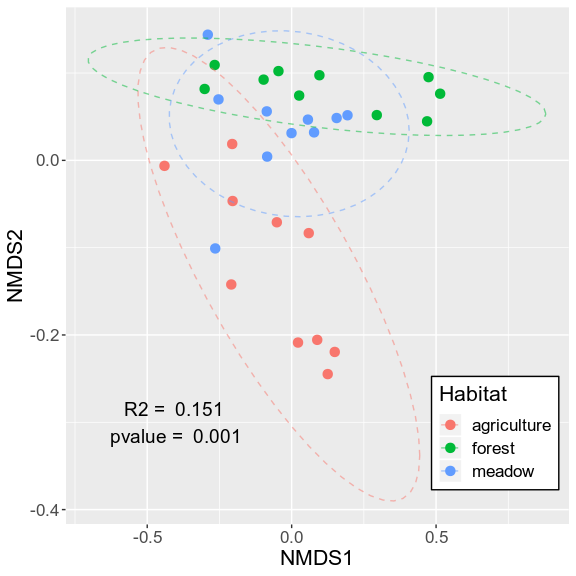<!-- -->

Again land use significantly explains community compositional variation.

## Soil properties and community composition

In addition to extracting DNA we also measured some aspects of the soil
properties for each soil sample. This soil property data includes pH,
moisture at collection, tempurature at collection, C:N ratio, and
percent organic carbon. We also measured the soil texture. For more
details on how these were measured please see methods section of
manuscript. Here I want to see how these soil properties explain
variation in community composition.

### Soil properties between habitats

The first thing I will do is just examine how soil properties differs
between habitats.

``` r
# Land use shapes
LandUse.shapes = c("Cropland" = 15, "Old-field" = 16, "Forest" = 17)

# Extract soil metadata
metadata = data.frame(sample_data(bulk.physeq.norm), stringsAsFactors = F) %>%
  rename(soil_temp = in_situ_soil_temp,
         percent_organic_matter = organic_content_perc,
         sand = sand__perc, silt = silt__perc, clay = clay__perc) %>%
  mutate(C.N_ratio = percent_C/percent_N,
         location = gsub("_", " ", location))
ecosystem.conv = data.frame(ecosystem = c("agriculture", "meadow", "forest"), ecosystem2 = c("Cropland", "Old-field", "Forest"))
metadata = left_join(metadata, ecosystem.conv)
metadata$ecosystem2 = factor(metadata$ecosystem2, levels = c("Cropland", "Old-field", "Forest"))

metadata$ecosystem = factor(metadata$ecosystem, levels = c("agriculture", "meadow", "forest"))

# pH
## Run a Kruskal-Wallis test to see if there are signifiant differences in OTU count between habitats.
writeLines("Kruskal-Wallis test for pH:")
```

    ## Kruskal-Wallis test for pH:

``` r
k.test = kruskal.test(pH ~ ecosystem2, data = metadata)
print(k.test)
```

    ## 
    ##  Kruskal-Wallis rank sum test
    ## 
    ## data:  pH by ecosystem2
    ## Kruskal-Wallis chi-squared = 0.72226, df = 2, p-value = 0.6969

``` r
writeLines("I did not find a significant effect of habitat on pH.")
```

    ## I did not find a significant effect of habitat on pH.

``` r
writeLines("\n--------------------\n")
```

    ## 
    ## --------------------

``` r
pH.plot = ggplot(data=metadata, aes(x=ecosystem2, y=pH))+
  geom_boxplot(outlier.shape=NA) +
  geom_jitter(aes(shape = ecosystem2), width = 0.2, alpha=0.3, size=2) +
  scale_shape_manual(values = LandUse.shapes) +
  labs(x="Land use", y="pH", title="pH") +
  theme_bw() +
  theme(axis.text.x = element_text(angle=45, hjust=1),
        axis.text = element_text(size=12),
        axis.title.y = element_blank(),
        axis.title.x = element_blank(),
        plot.title = element_text(hjust = 0.5),
        legend.position = "none")

# Moisture
## Run a Kruskal-Wallis test to see if there are signifiant differences in OTU count between habitats.
writeLines("Kruskal-Wallis test on moisture:")
```

    ## Kruskal-Wallis test on moisture:

``` r
k.test = kruskal.test(moisture ~ ecosystem2, data = metadata)
print(k.test)
```

    ## 
    ##  Kruskal-Wallis rank sum test
    ## 
    ## data:  moisture by ecosystem2
    ## Kruskal-Wallis chi-squared = 7.0215, df = 2, p-value = 0.02987

``` r
writeLines("There is a significant effect of habitat on moisture. Now running Dunn test for pairwise comparisons:\n")
```

    ## There is a significant effect of habitat on moisture. Now running Dunn test for pairwise comparisons:

``` r
d.test = dunnTest(moisture ~ ecosystem2, data = metadata, method = "bh")
print(d.test)
```

    ##             Comparison          Z    P.unadj      P.adj
    ## 1    Cropland - Forest -0.2033813 0.83883704 0.83883704
    ## 2 Cropland - Old-field -2.3897299 0.01686077 0.05058230
    ## 3   Forest - Old-field -2.1863486 0.02879011 0.04318516

``` r
writeLines("\n--------------------\n")
```

    ## 
    ## --------------------

``` r
# Temperature
## Run a Kruskal-Wallis test to see if there are signifiant differences in OTU count between habitats.
writeLines("Kruskal-Wallis test on soil temp:")
```

    ## Kruskal-Wallis test on soil temp:

``` r
k.test = kruskal.test(soil_temp ~ ecosystem2, data = metadata)
print(k.test)
```

    ## 
    ##  Kruskal-Wallis rank sum test
    ## 
    ## data:  soil_temp by ecosystem2
    ## Kruskal-Wallis chi-squared = 0.13428, df = 2, p-value = 0.9351

``` r
writeLines("I did not find a significant effect of habitat on soil temp")
```

    ## I did not find a significant effect of habitat on soil temp

``` r
writeLines("\n--------------------\n")
```

    ## 
    ## --------------------

``` r
# C:N ratio
## Run a Kruskal-Wallis test to see if there are signifiant differences in OTU count between habitats.
writeLines("Kruskal-Wallis test on C:N ratio:")
```

    ## Kruskal-Wallis test on C:N ratio:

``` r
k.test = kruskal.test(C.N_ratio ~ ecosystem2, data = metadata)
print(k.test)
```

    ## 
    ##  Kruskal-Wallis rank sum test
    ## 
    ## data:  C.N_ratio by ecosystem2
    ## Kruskal-Wallis chi-squared = 21.608, df = 2, p-value = 2.032e-05

``` r
writeLines("There is a significant effect of habitat on C:N ratio. Now running Dunn test for pairwise comparisons:\n")
```

    ## There is a significant effect of habitat on C:N ratio. Now running Dunn test for pairwise comparisons:

``` r
d.test = dunnTest(C.N_ratio ~ ecosystem2, data = metadata, method = "bh")
print(d.test)
```

    ##             Comparison         Z      P.unadj        P.adj
    ## 1    Cropland - Forest -4.648205 3.348366e-06 0.0000100451
    ## 2 Cropland - Old-field -2.286002 2.225412e-02 0.0222541248
    ## 3   Forest - Old-field  2.362202 1.816672e-02 0.0272500840

``` r
writeLines("\n--------------------\n")
```

    ## 
    ## --------------------

``` r
dunn.res = d.test$res %>% mutate(property = "CN")

CN.plot = ggplot(data=metadata, aes(x=ecosystem2, y=C.N_ratio))+
  geom_boxplot(outlier.shape=NA) +
  geom_jitter(aes(shape = ecosystem2), width = 0.2, alpha=0.3, size=2) +
  scale_shape_manual(values = LandUse.shapes) +
  labs(x="Land use", y="C:N ratio", title="C:N ratio") +
  theme_bw() +
  theme(axis.text.x = element_text(angle=45, hjust=1),
        axis.text = element_text(size=12),
        axis.title.y = element_blank(),
        axis.title.x = element_blank(),
        plot.title = element_text(hjust = 0.5),
        legend.position = "none") +
  annotate("text", label=c("***","*", "*"), x=c(2, 2.5, 1.5), y=c(19.3, 18.8, 18.4), size=4) +
  annotate("segment", x=c(1,1,3, 2,2,3, 1,1,2), xend=c(1,3,3, 2,3,3, 1,2,2), 
           y=c(19.1,19.3,19.3, 18.6,18.8,18.8, 18.2,18.4,18.4), yend=c(19.3,19.3,19.1, 18.8,18.8,18.6, 18.4,18.4,18.2), size=0.5)

# Percent organic matter
## Run a Kruskal-Wallis test to see if there are signifiant differences in OTU count between habitats.
writeLines("Kruskal-Wallis test on percent organic matter:")
```

    ## Kruskal-Wallis test on percent organic matter:

``` r
k.test = kruskal.test(percent_organic_matter ~ ecosystem2, data = metadata)
print(k.test)
```

    ## 
    ##  Kruskal-Wallis rank sum test
    ## 
    ## data:  percent_organic_matter by ecosystem2
    ## Kruskal-Wallis chi-squared = 12.483, df = 2, p-value = 0.001947

``` r
writeLines("There is a significant effect of habitat on percent organic matter. Now running Dunn test for pairwise comparisons:\n")
```

    ## There is a significant effect of habitat on percent organic matter. Now running Dunn test for pairwise comparisons:

``` r
d.test = dunnTest(percent_organic_matter ~ ecosystem2, data = metadata, method = "bh")
print(d.test)
```

    ##             Comparison         Z      P.unadj       P.adj
    ## 1    Cropland - Forest -3.530604 0.0004146127 0.001243838
    ## 2 Cropland - Old-field -1.879602 0.0601623569 0.090243535
    ## 3   Forest - Old-field  1.651002 0.0987382378 0.098738238

``` r
writeLines("\n--------------------\n")
```

    ## 
    ## --------------------

``` r
dunn.res = rbind(dunn.res, d.test$res %>% mutate(property = "SOC"))

SOC.plot = ggplot(data=metadata, aes(x=ecosystem2, y=percent_organic_matter))+
  geom_boxplot(outlier.shape=NA) +
  geom_jitter(aes(shape = ecosystem2), width = 0.2, alpha=0.3, size=2) +
  scale_shape_manual(values = LandUse.shapes) +
  labs(x="Land use", y="SOM (%)", title="SOM") +
  theme_bw() +
  theme(axis.text.x = element_text(angle=45, hjust=1),
        axis.text = element_text(size=12),
        axis.title.y = element_blank(),
        axis.title.x = element_blank(),
        plot.title = element_text(hjust = 0.5),
        legend.position = "none") +
  annotate("text", label=c("**"), x=c(2), y=c(0.205), size=4) +
  annotate("segment", x=c(1,1,3), xend=c(1,3,3), 
           y=c(0.2,0.205,0.205), yend=c(0.205,0.205,0.2), size=0.5)

# Percent sand (Soil Texture)
## Run a Kruskal-Wallis test to see if there are signifiant differences in OTU count between habitats.
writeLines("Kruskal-Wallis test on percent sand:")
```

    ## Kruskal-Wallis test on percent sand:

``` r
k.test = kruskal.test(sand ~ ecosystem2, data = metadata)
print(k.test)
```

    ## 
    ##  Kruskal-Wallis rank sum test
    ## 
    ## data:  sand by ecosystem2
    ## Kruskal-Wallis chi-squared = 13.228, df = 2, p-value = 0.001342

``` r
writeLines("There is a significant effect of habitat on percent sand. Now running Dunn test for pairwise comparisons:\n")
```

    ## There is a significant effect of habitat on percent sand. Now running Dunn test for pairwise comparisons:

``` r
d.test = dunnTest(sand ~ ecosystem2, data = metadata, method = "bh")
print(d.test)
```

    ##             Comparison         Z      P.unadj       P.adj
    ## 1    Cropland - Forest -2.344377 0.0190588916 0.028588337
    ## 2 Cropland - Old-field -3.580272 0.0003432374 0.001029712
    ## 3   Forest - Old-field -1.235894 0.2164978043 0.216497804

``` r
writeLines("\n--------------------\n")
```

    ## 
    ## --------------------

``` r
dunn.res = rbind(dunn.res, d.test$res %>% mutate(property = "Sand"))

sand.plot = ggplot(data=metadata, aes(x=ecosystem2, y=sand))+
  geom_boxplot(outlier.shape=NA) +
  geom_jitter(aes(shape = ecosystem2), width = 0.2, alpha=0.3, size=2) +
  scale_shape_manual(values = LandUse.shapes) +
  labs(x="Land use", y="Sand (%)", title="Sand (%)") +
  theme_bw() +
  theme(axis.text.x = element_text(angle=45, hjust=1),
        axis.text = element_text(size=12),
        axis.title.y = element_blank(),
        axis.title.x = element_blank(),
        plot.title = element_text(hjust = 0.5),
        legend.position = "none") +
  annotate("text", label=c("*", "**"), x=c(2, 1.5), y=c(90, 86), size=4) +
  annotate("segment", x=c(1,1,3, 1,1,2), xend=c(1,3,3, 1,2,2), 
           y=c(89,90,90, 85,86,86), yend=c(90,90,89, 86,86,85), size=0.5)

# Now plot all together
soilchem.plot = cowplot::plot_grid(pH.plot, SOC.plot, CN.plot, sand.plot, ncol = 4, rel_widths = c(1,1,1,1))
soilchem.plot
```

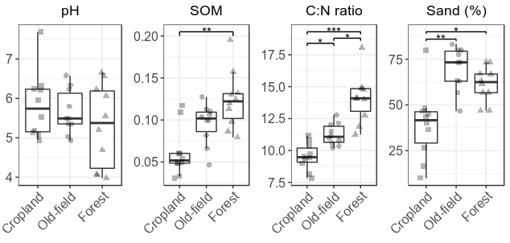<!-- -->

``` r
#ggsave("soilchem.tiff", plot=soilchem.plot, device="tiff", 
#       path="/home/sam/notebooks/fullCyc2/figures/community_assembly_MS/",
#       width=168, height=80, units="mm", dpi=600)
```

The only significant effects we saw are on moisture, C:N ratio, and
percent organic matter.

  - Moisture: forest was significantly different than meadow, where
    meadow soils were more moist than forest soils.
  - C:N rato: All habitats were significantly different than eachother.
    Forest \> meadow \> agriculture (forest soil had the most carbon per
    nitrogen and agriculture soil had the least carbon per nitrogen)
  - percent organic matter: Agriculture was significantly different than
    forest, where forest soil had more organic matter than agricultural
    soil

### How soil properties on community composition

I want to know how much of the variation in the community composition is
explained by the soil properties For this analysis I will use a
constrained ordination ordination approach using the `CAP` method of
`phyloseq::ordinate`. I will use `vegan::ordistep` to select only
significant soil properties variables. For the ordinations I will use
the weighted UniFrac distance.

``` r
# Function for running the cap analyses
cap_func = function(physeq, seed){
  # Modify the metadata a bit to get easier to read variables and generate a C:N ratio variable
  meta = data.frame(sample_data(physeq), stringsAsFactors = F) %>%
    rename(Temp = in_situ_soil_temp,
           SOM = organic_content_perc,
           Sand = sand__perc) %>%
    mutate(C.N = percent_C/percent_N,
           location = gsub("_", " ", location))
  rownames(meta) = meta$X.Sample
  sample_data(physeq) = sample_data(meta)
  
  # Extract which habitat you are looking at
  habitat = unique(as.character(meta$ecosystem))[1]
  
  writeLines(paste("Running", habitat, "\n"))
  
  # Get weighted unifrac distance matrix
  wuf.dist = phyloseq::distance(physeq, "wunifrac")
  
  # Ordinate
  set.seed(seed)
  cap_ord.full <- ordinate(physeq = physeq, method = "CAP", distance = wuf.dist, 
                      formula = ~ pH + SOM + C.N + Sand)
  set.seed(seed)
  cap_ord.null <- ordinate(physeq = physeq, method = "CAP", distance = wuf.dist, formula = ~ 1)

  # Model selection to get just significant variables
  set.seed(seed)
  ordistep.res = ordistep(cap_ord.null, scope = formula(cap_ord.full), perm.max = 1000, trace=F)
  goodform = ordistep.res$call$formula
  set.seed(seed)
  cap_ord <- ordinate(physeq = physeq, method = "CAP", distance = wuf.dist, formula = goodform)
  
  # CAP plot
  cap_plot <- plot_ordination(physeq = physeq, ordination = cap_ord, 
                              color = "location", axes = c(1,2))
  
  # Now add the environmental variables as arrows
  arrowmat <- vegan::scores(cap_ord, display = "bp")
  
  # Add labels, make a data.frame
  arrowdf <- data.frame(labels = rownames(arrowmat), arrowmat) %>%
    mutate(labels = gsub("\\.", ":", labels))
  colnames(arrowdf) = c("labels", "xend", "yend")
  
  # Define the arrow aesthetic mapping
  arrow_map <- aes(xend = xend, yend = yend, x = 0, y = 0, 
                   color = NULL)
  
  label_map <- aes(x = 1.1 * xend, y = 1.1 * yend, 
                   color = NULL, label = labels)
  
  arrowhead = arrow(length = unit(0.02, "npc"))
  
  # Make a new graphic
  cap_plot = cap_plot + 
    geom_segment(mapping = arrow_map, size = .5, data = arrowdf, color = "red", arrow = arrowhead) + 
    geom_text_repel(mapping = label_map, size = 4, data = arrowdf, color = "red", show.legend = FALSE) +
    ggtitle(habitat)
  print(cap_plot)
  
  print(anova(cap_ord))
  
  writeLines(paste("\nTested environmental variabibles explain", round(100*RsquareAdj(cap_ord)$r.squared, 3), "% of the variation"))

  writeLines("\n--------------------\n")
  
  return(cap_plot)
}

# Running the CAP analysis for each land use and across the region
cap.plot.list = list()

## Agriculture
sub.physeq.norm = subset_samples(bulk.physeq.norm, ecosystem == "agriculture")
ag.cap.plot = cap_func(sub.physeq.norm, 7272)
```

    ## Running agriculture

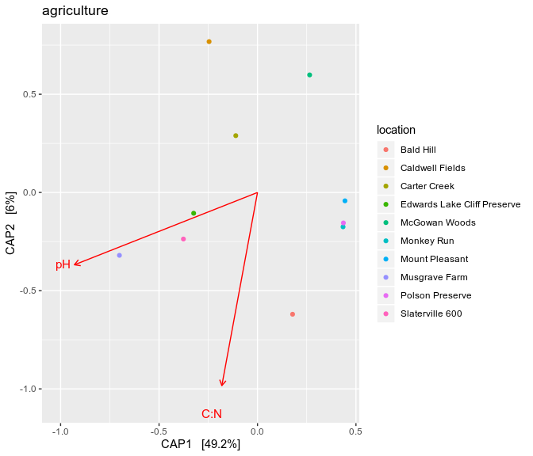<!-- -->

    ## Permutation test for capscale under reduced model
    ## Permutation: free
    ## Number of permutations: 999
    ## 
    ## Model: capscale(formula = distance ~ pH + C.N, data = data)
    ##          Df SumOfSqs      F Pr(>F)   
    ## Model     2 0.112260 4.3211  0.002 **
    ## Residual  7 0.090929                 
    ## ---
    ## Signif. codes:  0 '***' 0.001 '**' 0.01 '*' 0.05 '.' 0.1 ' ' 1
    ## 
    ## Tested environmental variabibles explain 55.249 % of the variation
    ## 
    ## --------------------

``` r
## Meadow
sub.physeq.norm = subset_samples(bulk.physeq.norm, ecosystem == "meadow")
m.cap.plot = cap_func(sub.physeq.norm, 7272)
```

    ## Running meadow

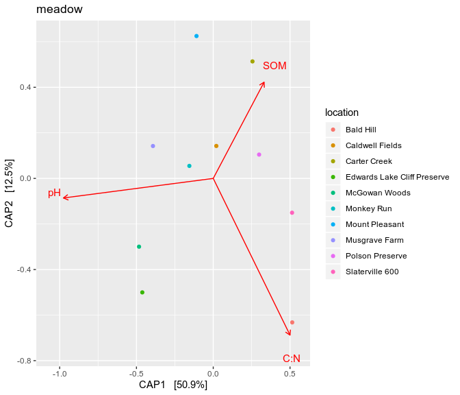<!-- -->

    ## Permutation test for capscale under reduced model
    ## Permutation: free
    ## Number of permutations: 999
    ## 
    ## Model: capscale(formula = distance ~ pH + C.N + SOM, data = data)
    ##          Df SumOfSqs      F Pr(>F)    
    ## Model     3  0.12390 4.8645  0.001 ***
    ## Residual  6  0.05094                  
    ## ---
    ## Signif. codes:  0 '***' 0.001 '**' 0.01 '*' 0.05 '.' 0.1 ' ' 1
    ## 
    ## Tested environmental variabibles explain 70.865 % of the variation
    ## 
    ## --------------------

``` r
## Forest
sub.physeq.norm = subset_samples(bulk.physeq.norm, ecosystem == "forest")
f.cap.plot = cap_func(sub.physeq.norm, 7272)
```

    ## Running forest

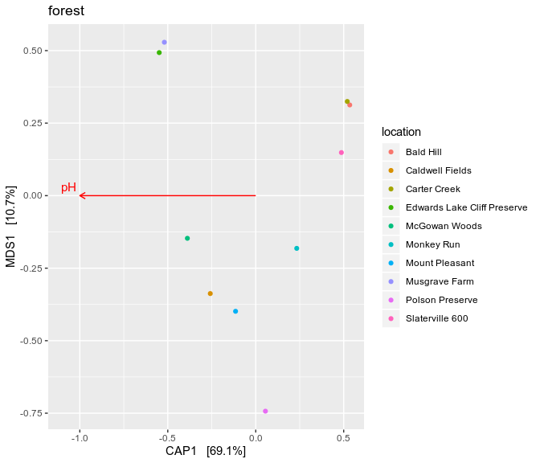<!-- -->

    ## Permutation test for capscale under reduced model
    ## Permutation: free
    ## Number of permutations: 999
    ## 
    ## Model: capscale(formula = distance ~ pH, data = data)
    ##          Df SumOfSqs      F Pr(>F)    
    ## Model     1 0.203361 17.873  0.001 ***
    ## Residual  8 0.091026                  
    ## ---
    ## Signif. codes:  0 '***' 0.001 '**' 0.01 '*' 0.05 '.' 0.1 ' ' 1
    ## 
    ## Tested environmental variabibles explain 69.08 % of the variation
    ## 
    ## --------------------

In all three habiats pH explains a significant portion of the variation
in community composition. In meadow samples, C:N ratio and percent
organic matter also significantly explain portions of the variance
although much less so than pH. In Agriculture soils, C:N ratio also
significantly explains a portion of the variance.

This is not all that suprising as many previous studies have found that
pH is a primary driver of microbial composition and that nutrient
availability can also play an important role.

Now plot these together

``` r
cap.leg = g_legend(ag.cap.plot)
ag.cap.plot.nl = ag.cap.plot + theme(legend.position="none")
f.cap.plot.nl = f.cap.plot + theme(legend.position="none")
m.cap.plot.nl = m.cap.plot + theme(legend.position="none")

cowplot::plot_grid(ag.cap.plot.nl, m.cap.plot.nl, f.cap.plot.nl, cap.leg)
```

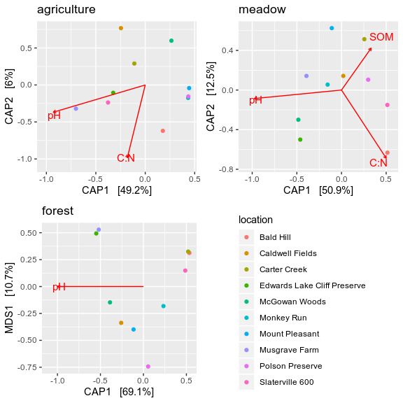<!-- -->

### Publication figure

For publication make a plot of all the CAP analyses as well as the
weighted UniFrac ordination of all sites.

First make the ordination of all the samples.

Now make the CAP analysis figures.

    ## Running agriculture 
    ## 
    ## 
    ## Running meadow 
    ## 
    ## 
    ## Running forest

Now merge them together for the final figure.

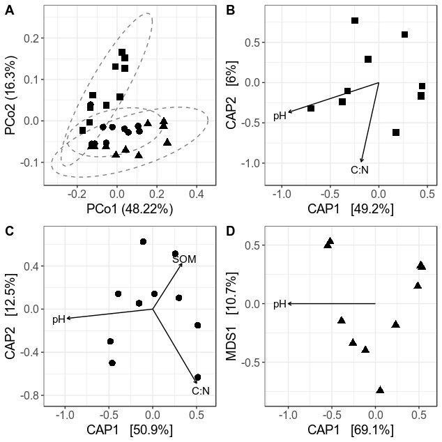<!-- -->

## Session Info

``` r
sessionInfo()
```

    ## R version 3.4.4 (2018-03-15)
    ## Platform: x86_64-pc-linux-gnu (64-bit)
    ## Running under: Ubuntu 18.04.3 LTS
    ## 
    ## Matrix products: default
    ## BLAS: /usr/lib/x86_64-linux-gnu/blas/libblas.so.3.7.1
    ## LAPACK: /usr/lib/x86_64-linux-gnu/lapack/liblapack.so.3.7.1
    ## 
    ## locale:
    ##  [1] LC_CTYPE=en_US.UTF-8       LC_NUMERIC=C              
    ##  [3] LC_TIME=en_US.UTF-8        LC_COLLATE=en_US.UTF-8    
    ##  [5] LC_MONETARY=en_US.UTF-8    LC_MESSAGES=en_US.UTF-8   
    ##  [7] LC_PAPER=en_US.UTF-8       LC_NAME=C                 
    ##  [9] LC_ADDRESS=C               LC_TELEPHONE=C            
    ## [11] LC_MEASUREMENT=en_US.UTF-8 LC_IDENTIFICATION=C       
    ## 
    ## attached base packages:
    ## [1] stats     graphics  grDevices utils     datasets  methods   base     
    ## 
    ## other attached packages:
    ##  [1] ggrepel_0.8.1   ggplot2_3.2.1   FSA_0.8.25      vegan_2.5-6    
    ##  [5] lattice_0.20-38 permute_0.9-5   ape_5.3         phyloseq_1.22.3
    ##  [9] tibble_2.1.3    dplyr_0.8.3    
    ## 
    ## loaded via a namespace (and not attached):
    ##  [1] tidyselect_0.2.5    xfun_0.10           reshape2_1.4.3     
    ##  [4] purrr_0.3.2         splines_3.4.4       rhdf5_2.22.0       
    ##  [7] colorspace_1.4-1    htmltools_0.4.0     stats4_3.4.4       
    ## [10] mgcv_1.8-31         yaml_2.2.0          survival_3.1-7     
    ## [13] rlang_0.4.0         pillar_1.4.2        withr_2.1.2        
    ## [16] glue_1.3.1          BiocGenerics_0.24.0 foreach_1.4.7      
    ## [19] plyr_1.8.4          stringr_1.4.0       zlibbioc_1.24.0    
    ## [22] Biostrings_2.46.0   munsell_0.5.0       gtable_0.3.0       
    ## [25] codetools_0.2-16    evaluate_0.14       labeling_0.3       
    ## [28] Biobase_2.38.0      knitr_1.25          IRanges_2.12.0     
    ## [31] biomformat_1.6.0    parallel_3.4.4      Rcpp_1.0.2         
    ## [34] scales_1.0.0        S4Vectors_0.16.0    jsonlite_1.6       
    ## [37] XVector_0.18.0      digest_0.6.21       stringi_1.4.3      
    ## [40] cowplot_0.9.2       ade4_1.7-13         grid_3.4.4         
    ## [43] tools_3.4.4         magrittr_1.5        lazyeval_0.2.2     
    ## [46] cluster_2.1.0       crayon_1.3.4        pkgconfig_2.0.3    
    ## [49] MASS_7.3-51.4       Matrix_1.2-17       data.table_1.12.4  
    ## [52] assertthat_0.2.1    rmarkdown_1.16      iterators_1.0.12   
    ## [55] dunn.test_1.3.5     R6_2.4.0            multtest_2.34.0    
    ## [58] igraph_1.2.4.1      nlme_3.1-142        compiler_3.4.4
