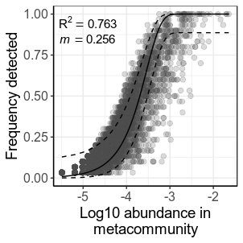

Sloan Neutral Model
================
Samuel Barnett
06 December, 2019

## Introduction

This notebook goes through the analysis modeling the Sloan neutral model
to examine soil bacterial community assembly in a finger lakes region.

### Initiate libraries

``` r
# Packages needed for analysis
library(dplyr)
library(tibble)
library(phyloseq)
library(ape)
library(vegan)
library(FSA)
library(eulerr)

# Packages needed for plotting
library(ggplot2)
library(grid)
library(gridExtra)
```

### Import data

``` r
# Import bulk soil phyloseq data
bulk.physeq = readRDS("/home/sam/data/fullCyc2_data/bulk_soil_physeq.RDS")

## Check how many reads you have in each of the samples. This will tell you if you need to re-do anything
# Get read counts and make a new dataframe with this data
read_count = data.frame("count" = colSums(otu_table(bulk.physeq))) %>%
  rownames_to_column(var="X.Sample") %>%
  inner_join(data.frame(sample_data(bulk.physeq)), by="X.Sample") %>%
  arrange(-count) %>%
  mutate(X.Sample=factor(X.Sample, levels=X.Sample))

# Now plot read count for each sample. The horizontal line represents a 2000 read threshold
ggplot(data=read_count, aes(x=X.Sample, y=log10(count), fill=ecosystem)) +
  geom_bar(stat="identity") +
  labs(x="Sample", y="Log10(Read count)") +
  geom_hline(yintercept=log10(10000)) +
  theme(text = element_text(size=16),
        axis.text.x = element_blank())
```

<!-- -->

``` r
# Everything seems to be at or above 10000 total reads

bulk.physeq
```

    ## phyloseq-class experiment-level object
    ## otu_table()   OTU Table:         [ 15112 taxa and 30 samples ]
    ## sample_data() Sample Data:       [ 30 samples by 30 sample variables ]
    ## tax_table()   Taxonomy Table:    [ 15112 taxa by 7 taxonomic ranks ]
    ## phy_tree()    Phylogenetic Tree: [ 15112 tips and 15111 internal nodes ]

All samples have over 10,000 reads except for one of the forest samples
that is just about at 10,000 reads, which is great. We don’t need to
remove any datasets for lack of sequences.

Now we need to rarefy the data to normalize the sequencing depth. We
should also get a normalized dataset which gives relative abundance
rather than readcounts.

``` r
# Rarefy to an even depth
set.seed(72)  # setting seed for reproducibility
bulk.physeq.rare = rarefy_even_depth(bulk.physeq)

# Normalize read counts (this gives relative abundance)
bulk.physeq.norm = transform_sample_counts(bulk.physeq.rare, function(x) x/sum(x))
```

## Testing neutral model fit

Now lets fit the sloan neutral model to our data. I will do this for the
entire dataset together (irregardless of land use). This code was
adapted from Adam Burns et al. 2016.

Burns, A., Stephens, W., Stagaman, K. et al. Contribution of neutral
processes to the assembly of gut microbial communities in the zebrafish
over host development. ISME J 10, 655–664 (2016)
<doi:10.1038/ismej.2015.142>

``` r
## Code adapted from Adam Burns (http://dx.doi.org/10.1038/ismej.2015.142)
require(minpack.lm)
require(Hmisc)
require(stats4)
# Extract the OTU table from pthe phyloseq object
OTU.table = t(otu_table(bulk.physeq.rare))

# Calculate the number of individuals in the meta community (Average read depth)
N <- mean(apply(OTU.table, 1, sum))

# Calculate the average relative abundance of each taxa across communities
p.m <- apply(OTU.table, 2, mean)
p.m <- p.m[p.m != 0]
p <- p.m/N
p.df = data.frame(p) %>%
  rownames_to_column(var="OTU")

# Calculate the occurrence frequency of each taxa
OTU.table.bi <- 1*(OTU.table>0)
freq.table <- apply(OTU.table.bi, 2, mean)
freq.table <- freq.table[freq.table != 0]
freq.df = data.frame(OTU=names(freq.table), freq=freq.table)

#Combine
C <- inner_join(p.df,freq.df, by="OTU") %>%
  arrange(p)
# Remove rows with any zero (absent in either source pool or local communities). You already did this, but just to make sure we will do it again.
C.no0 <- C %>%
  filter(freq != 0, p != 0)

#Calculate the limit of detection
d <- 1/N

##Fit model parameter m (or Nm) using Non-linear least squares (NLS)
p.list <- C.no0$p
freq.list <- C.no0$freq
m.fit <- nlsLM(freq.list ~ pbeta(d, N*m*p.list, N*m*(1-p.list), lower.tail=FALSE), start=list(m=0.1))
m.ci <- confint(m.fit, 'm', level=0.95)
m.sum <- summary(m.fit)
m.coef = coef(m.fit)

freq.pred <- pbeta(d, N*coef(m.fit)*p.list, N*coef(m.fit)*(1-p.list), lower.tail=FALSE)
Rsqr <- 1 - (sum((freq.list - freq.pred)^2))/(sum((freq.list - mean(freq.list))^2))

# Get table of model fit stats
fitstats <- data.frame(m=m.coef, m.low.ci=m.ci[1], m.up.ci=m.ci[2], 
                       Rsqr=Rsqr, p.value=m.sum$parameters[4], N=N, 
                       Samples=nrow(OTU.table), Richness=length(p.list), 
                       Detect=d)

# Get confidence interval for predictions
freq.pred.ci <- binconf(freq.pred*nrow(OTU.table), nrow(OTU.table), alpha=0.05, method="wilson", return.df=TRUE)

# Get table of predictions
pred.df <- data.frame(metacomm_RA=p.list, frequency=freq.pred, 
                      frequency_lowerCI=freq.pred.ci[,2], 
                      frequency_upperCI=freq.pred.ci[,3]) %>%
  unique()

# Get table of observed occupancy and abundance
obs.df = C.no0 %>%
  rename(metacomm_RA = p, frequency=freq)
```

Plot the model and observed occupancy and metacommunity abundance
values.

``` r
fulldata.model.plot = ggplot(data=obs.df) +
    geom_point(data=obs.df, aes(x=log10(metacomm_RA), y=frequency), 
               alpha=.2, size=2, color="grey30") +
    geom_line(data=pred.df, aes(x=log10(metacomm_RA), y=frequency), color="black") + 
    geom_line(data=pred.df, aes(x=log10(metacomm_RA), y=frequency_lowerCI), linetype=2, color="black") + 
    geom_line(data=pred.df, aes(x=log10(metacomm_RA), y=frequency_upperCI), linetype=2, color="black") + 
    geom_text(data=fitstats, aes(label = paste("R^2 == ", round(Rsqr, 3))), 
              x=-4.9, y=0.95, size=4, parse=TRUE) +
    geom_text(data=fitstats, aes(label = paste("italic(m) ==", round(m, 3))), 
              x=-4.9, y=0.85, size=4, parse=TRUE) + 
    labs(x="Log10 abundance in\nmetacommunity", y="Frequency detected") +
    theme_bw() +
    theme(axis.line = element_line(color="black"),
          legend.position = "none",
          axis.title = element_text(size=14),
          axis.text = element_text(size=12))

fulldata.model.plot
```

<!-- -->

``` r
#ggsave("region_neutral_model.tiff", plot=fulldata.model.plot, device="tiff", 
#       path="/home/sam/notebooks/fullCyc2/figures/community_assembly_MS/",
#       width=80, height=80, units="mm")
```

## Session info

``` r
sessionInfo()
```

    ## R version 3.4.4 (2018-03-15)
    ## Platform: x86_64-pc-linux-gnu (64-bit)
    ## Running under: Ubuntu 18.04.3 LTS
    ## 
    ## Matrix products: default
    ## BLAS: /usr/lib/x86_64-linux-gnu/blas/libblas.so.3.7.1
    ## LAPACK: /usr/lib/x86_64-linux-gnu/lapack/liblapack.so.3.7.1
    ## 
    ## locale:
    ##  [1] LC_CTYPE=en_US.UTF-8       LC_NUMERIC=C              
    ##  [3] LC_TIME=en_US.UTF-8        LC_COLLATE=en_US.UTF-8    
    ##  [5] LC_MONETARY=en_US.UTF-8    LC_MESSAGES=en_US.UTF-8   
    ##  [7] LC_PAPER=en_US.UTF-8       LC_NAME=C                 
    ##  [9] LC_ADDRESS=C               LC_TELEPHONE=C            
    ## [11] LC_MEASUREMENT=en_US.UTF-8 LC_IDENTIFICATION=C       
    ## 
    ## attached base packages:
    ## [1] stats4    grid      stats     graphics  grDevices utils     datasets 
    ## [8] methods   base     
    ## 
    ## other attached packages:
    ##  [1] Hmisc_4.2-0      Formula_1.2-3    survival_3.1-7   minpack.lm_1.2-1
    ##  [5] gridExtra_2.3    ggplot2_3.2.1    eulerr_6.0.0     FSA_0.8.25      
    ##  [9] vegan_2.5-6      lattice_0.20-38  permute_0.9-5    ape_5.3         
    ## [13] phyloseq_1.22.3  tibble_2.1.3     dplyr_0.8.3     
    ## 
    ## loaded via a namespace (and not attached):
    ##  [1] Biobase_2.38.0      jsonlite_1.6        splines_3.4.4      
    ##  [4] foreach_1.4.7       assertthat_0.2.1    latticeExtra_0.6-28
    ##  [7] yaml_2.2.0          pillar_1.4.2        backports_1.1.5    
    ## [10] glue_1.3.1          digest_0.6.21       RColorBrewer_1.1-2 
    ## [13] XVector_0.18.0      checkmate_1.9.4     colorspace_1.4-1   
    ## [16] htmltools_0.4.0     Matrix_1.2-17       plyr_1.8.4         
    ## [19] pkgconfig_2.0.3     zlibbioc_1.24.0     purrr_0.3.2        
    ## [22] scales_1.0.0        htmlTable_1.13.2    mgcv_1.8-31        
    ## [25] IRanges_2.12.0      withr_2.1.2         nnet_7.3-12        
    ## [28] BiocGenerics_0.24.0 lazyeval_0.2.2      magrittr_1.5       
    ## [31] crayon_1.3.4        evaluate_0.14       nlme_3.1-142       
    ## [34] MASS_7.3-51.4       foreign_0.8-72      tools_3.4.4        
    ## [37] data.table_1.12.4   stringr_1.4.0       S4Vectors_0.16.0   
    ## [40] munsell_0.5.0       cluster_2.1.0       Biostrings_2.46.0  
    ## [43] ade4_1.7-13         compiler_3.4.4      rlang_0.4.0        
    ## [46] rhdf5_2.22.0        rstudioapi_0.10     iterators_1.0.12   
    ## [49] biomformat_1.6.0    htmlwidgets_1.5.1   igraph_1.2.4.1     
    ## [52] base64enc_0.1-3     labeling_0.3        rmarkdown_1.16     
    ## [55] gtable_0.3.0        codetools_0.2-16    multtest_2.34.0    
    ## [58] reshape2_1.4.3      R6_2.4.0            knitr_1.25         
    ## [61] stringi_1.4.3       parallel_3.4.4      Rcpp_1.0.2         
    ## [64] rpart_4.1-15        acepack_1.4.1       tidyselect_0.2.5   
    ## [67] xfun_0.10
