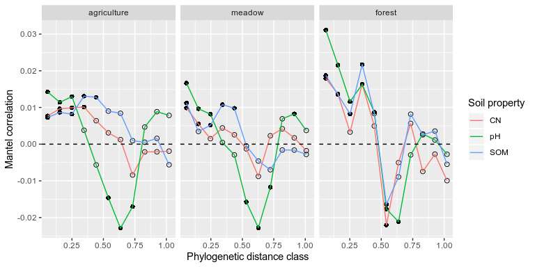
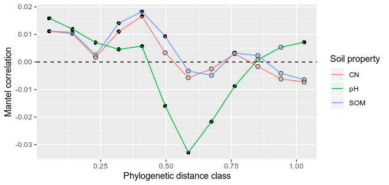
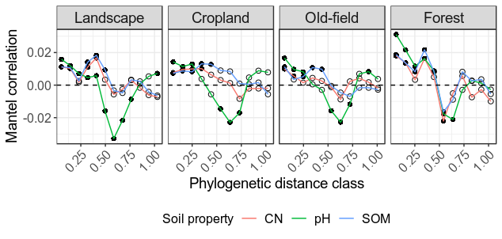

Testing for Phylogeneitic signal
================
Samuel Barnett
06 December, 2019

## Introduction

Before examining bMNTD or bNTI we need to see if there is a phylogenetic
signal of species (OTUs) and their niche preference. For this analysis
we will compare the phylogenetic distance in species and their niche
preference based on pH, C:N, and SOC since these three metrics showed
significant community variation in habitats. A significant positive
correlation between phylogenetic distance and niche preferences would
indicate a phylogenetic signal.

Please note that some of these cell have eval=FALSE so that they don’t
run. These cells will not be run with Rstudio since they take a while.

### Initiate libraries

``` r
# Packages needed for analysis
library(dplyr)
library(tidyr)
library(tibble)
library(phyloseq)
library(vegan)
library(ape) # Tree stuff

# Packages needed for plotting
library(ggplot2)
```

### Import data

``` r
# Import bulk soil phyloseq data
bulk.physeq = readRDS("/home/sam/data/fullCyc2_data/bulk_soil_physeq.RDS")

## Check how many reads you have in each of the samples. This will tell you if you need to re-do anything
# Get read counts and make a new dataframe with this data
read_count = data.frame("count" = colSums(otu_table(bulk.physeq))) %>%
  rownames_to_column(var="X.Sample") %>%
  inner_join(data.frame(sample_data(bulk.physeq)), by="X.Sample") %>%
  arrange(-count) %>%
  mutate(X.Sample=factor(X.Sample, levels=X.Sample))

# Now plot read count for each sample. The horizontal line represents a 2000 read threshold
ggplot(data=read_count, aes(x=X.Sample, y=log10(count), fill=ecosystem)) +
  geom_bar(stat="identity") +
  labs(x="Sample", y="Log10(Read count)") +
  geom_hline(yintercept=log10(10000)) +
  theme(text = element_text(size=16),
        axis.text.x = element_blank())
```

<!-- -->

``` r
# Everything seems to be at or above 10000 total reads

bulk.physeq
```

    ## phyloseq-class experiment-level object
    ## otu_table()   OTU Table:         [ 15112 taxa and 30 samples ]
    ## sample_data() Sample Data:       [ 30 samples by 30 sample variables ]
    ## tax_table()   Taxonomy Table:    [ 15112 taxa by 7 taxonomic ranks ]
    ## phy_tree()    Phylogenetic Tree: [ 15112 tips and 15111 internal nodes ]

Now we need to rarefy the data to normalize the sequencing depth. We
should also get a normalized dataset which gives relative abundance
rather than readcounts.

``` r
# Rarefy to an even depth
set.seed(72)  # setting seed for reproducibility
bulk.physeq.rare = rarefy_even_depth(bulk.physeq)

# Normalize read counts (this gives relative abundance)
bulk.physeq.norm = transform_sample_counts(bulk.physeq.rare, function(x) x/sum(x))
```

## Phylogenetic signal

I will use mantel corrrelog to see if there is a phylogenetic signal in
the niche preference for pH, percent SOM and C:N ratio. We want to see
some level of phylogenetic signal before moving on to the bNTI
(phylogenetic turnover) analysis. I will do this for the OTUs within
each land use regime and across the entire region.

### Within land use

First run the mantel correlogs analysis within each land use separately.
This should be run once since it takes a while (eval=FALSE).

``` r
for (eco in c("agriculture", "forest", "meadow")){
  # Subset data
  print(paste("Now running", eco))
  sub.physeq = subset_samples(bulk.physeq.norm, ecosystem == eco)
  
  # Remove OTUs not found in at least 3 samples
  OTU.table = otu_table(sub.physeq)
  OTU.table[OTU.table > 0] = 1
  OTU.freq = rowSums(OTU.table)
  OTU.freq = OTU.freq[OTU.freq > 2]
  sub.physeq = prune_taxa(names(OTU.freq), sub.physeq)
  sub.physeq
  
  # get phylogenetic distances
  tree = phy_tree(sub.physeq)
  phylo.dist = cophenetic(tree)
  sample_OTUs = tree$tip.label
  sam.phylo.dist = phylo.dist[sample_OTUs, sample_OTUs]
  sam.phylo.dist[upper.tri(sam.phylo.dist, diag=TRUE)] = NA
  
  # Generate dataframe of niche preference for pH, SOC and CN
  site.chem.mat = data.frame(sample_data(sub.physeq)) %>%
    mutate(CN = percent_C / percent_N) %>%
    dplyr::select(X.Sample, pH, organic_content_perc,CN)
  rownames(site.chem.mat) = site.chem.mat$X.Sample
  site.chem.mat$X.Sample = NULL
  site.chem.mat = as.matrix(site.chem.mat)
  
  otu.table = t(otu_table(sub.physeq))
  
  OTU.niche = wascores(site.chem.mat, otu.table)
  OTU.niche.df = data.frame(OTU.niche)
  OTU.niche.df
  
  pH.pref = OTU.niche.df$pH
  names(pH.pref) = rownames(OTU.niche.df)
  pH.dist = as.matrix(dist(pH.pref), labels=TRUE)
  sam.pH.dist = pH.dist[sample_OTUs, sample_OTUs]
  sam.pH.dist[upper.tri(sam.pH.dist, diag=TRUE)] = NA
  
  sam.pH.crlg = mantel.correlog(sam.pH.dist, sam.phylo.dist)
  filename = paste(eco, "pH_crlg.rds", sep="_")
  saveRDS(sam.pH.crlg, file=filename)
  
  SOC.pref = OTU.niche.df$organic_content_perc
  names(SOC.pref) = rownames(OTU.niche.df)
  SOC.dist = as.matrix(dist(SOC.pref), labels=TRUE)
  sam.SOC.dist = SOC.dist[sample_OTUs, sample_OTUs]
  sam.SOC.dist[upper.tri(sam.SOC.dist, diag=TRUE)] = NA
  
  sam.SOC.crlg = mantel.correlog(sam.SOC.dist, sam.phylo.dist)
  filename = paste(eco, "SOC_crlg.rds", sep="_")
  saveRDS(sam.SOC.crlg, file=filename)

  CN.pref = OTU.niche.df$CN
  names(CN.pref) = rownames(OTU.niche.df)
  CN.dist = as.matrix(dist(CN.pref), labels=TRUE)
  sam.CN.dist = CN.dist[sample_OTUs, sample_OTUs]
  sam.CN.dist[upper.tri(sam.CN.dist, diag=TRUE)] = NA
  
  sam.CN.crlg = mantel.correlog(sam.CN.dist, sam.phylo.dist)
  filename = paste(eco, "CN_crlg.rds", sep="_")
  saveRDS(sam.CN.crlg, file=filename)
}
```

Read in the data and plot the correlograms.

``` r
# Import data
ag.pH.crlg = data.frame(readRDS(file="/home/sam/data/fullCyc2_data/Final_data/community_assembly/agriculture_pH_crlg.rds")$mantel.res) %>%
  mutate(ecosystem = "agriculture", property = "pH")
ag.SOC.crlg = data.frame(readRDS(file="/home/sam/data/fullCyc2_data/Final_data/community_assembly/agriculture_SOC_crlg.rds")$mantel.res) %>%
  mutate(ecosystem = "agriculture", property = "SOM")
ag.CN.crlg = data.frame(readRDS(file="/home/sam/data/fullCyc2_data/Final_data/community_assembly/agriculture_CN_crlg.rds")$mantel.res) %>%
  mutate(ecosystem = "agriculture", property = "CN")

m.pH.crlg = data.frame(readRDS(file="/home/sam/data/fullCyc2_data/Final_data/community_assembly/meadow_pH_crlg.rds")$mantel.res) %>%
  mutate(ecosystem = "meadow", property = "pH")
m.SOC.crlg = data.frame(readRDS(file="/home/sam/data/fullCyc2_data/Final_data/community_assembly/meadow_SOC_crlg.rds")$mantel.res) %>%
  mutate(ecosystem = "meadow", property = "SOM")
m.CN.crlg = data.frame(readRDS(file="/home/sam/data/fullCyc2_data/Final_data/community_assembly/meadow_CN_crlg.rds")$mantel.res) %>%
  mutate(ecosystem = "meadow", property = "CN")

f.pH.crlg = data.frame(readRDS(file="/home/sam/data/fullCyc2_data/Final_data/community_assembly/forest_pH_crlg.rds")$mantel.res) %>%
  mutate(ecosystem = "forest", property = "pH")
f.SOC.crlg = data.frame(readRDS(file="/home/sam/data/fullCyc2_data/Final_data/community_assembly/forest_SOC_crlg.rds")$mantel.res) %>%
  mutate(ecosystem = "forest", property = "SOM")
f.CN.crlg = data.frame(readRDS(file="/home/sam/data/fullCyc2_data/Final_data/community_assembly/forest_CN_crlg.rds")$mantel.res) %>%
  mutate(ecosystem = "forest", property = "CN")

eco.crlg = rbind(ag.pH.crlg, ag.SOC.crlg, ag.CN.crlg, m.pH.crlg, m.SOC.crlg, m.CN.crlg, f.pH.crlg, f.SOC.crlg, f.CN.crlg) %>%
  mutate(sig = ifelse(Pr.corrected. <= 0.05, "significant", "non-significant")) %>%
  filter(!(is.na(Pr.corrected.)))
eco.crlg$ecosystem = factor(eco.crlg$ecosystem, levels = c("agriculture", "meadow", "forest"))

ggplot(data=eco.crlg, aes(x=class.index, y=Mantel.cor)) +
  geom_point(data=eco.crlg[eco.crlg$sig=="significant",], color = "black", size=2, shape=16) +
  geom_point(data=eco.crlg[eco.crlg$sig=="non-significant",], color = "black",size=2, shape=1) +
  geom_line(data=eco.crlg, aes(color=property)) +
  geom_hline(yintercept = 0, linetype=2) +
  labs(x = "Phylogenetic distance class", y="Mantel correlation", color="Soil property") +
  facet_grid(~ecosystem)
```

<!-- -->

We do see significant positive correlation between phylogenetic distance
and niche preference in lower phylogenetic classes within each land use
regime.

### Across the entire dataset

Now I’ll run the analysis for all sites across the region regardless of
land use regime. Again the correlog analysis should be run once since it
takes a while (eval=FALSE).

``` r
# Remove OTUs not found in at least 3 samples
OTU.table = otu_table(bulk.physeq.norm)
OTU.table[OTU.table > 0] = 1
OTU.freq = rowSums(OTU.table)
OTU.freq = OTU.freq[OTU.freq > 2]
bulk.physeq.norm.pop = prune_taxa(names(OTU.freq), bulk.physeq.norm)
bulk.physeq.norm.pop

# get phylogenetic distances
tree = phy_tree(bulk.physeq.norm.pop)
phylo.dist = cophenetic(tree)
sample_OTUs = tree$tip.label
sam.phylo.dist = phylo.dist[sample_OTUs, sample_OTUs]
sam.phylo.dist[upper.tri(sam.phylo.dist, diag=TRUE)] = NA

# Generate dataframe of niche preference for pH, SOC and CN
site.chem.mat = data.frame(sample_data(bulk.physeq.norm.pop)) %>%
  mutate(CN = percent_C / percent_N) %>%
  dplyr::select(X.Sample, pH, organic_content_perc,CN)
rownames(site.chem.mat) = site.chem.mat$X.Sample
site.chem.mat$X.Sample = NULL
site.chem.mat = as.matrix(site.chem.mat)

otu.table = t(otu_table(bulk.physeq.norm.pop))

OTU.niche = wascores(site.chem.mat, otu.table)
OTU.niche.df = data.frame(OTU.niche)
OTU.niche.df

pH.pref = OTU.niche.df$pH
names(pH.pref) = rownames(OTU.niche.df)
pH.dist = as.matrix(dist(pH.pref), labels=TRUE)
sam.pH.dist = pH.dist[sample_OTUs, sample_OTUs]
sam.pH.dist[upper.tri(sam.pH.dist, diag=TRUE)] = NA

sam.pH.crlg = mantel.correlog(sam.pH.dist, sam.phylo.dist)
saveRDS(sam.pH.crlg, file="full.pH.crlg.rds")

SOC.pref = OTU.niche.df$organic_content_perc
names(SOC.pref) = rownames(OTU.niche.df)
SOC.dist = as.matrix(dist(SOC.pref), labels=TRUE)
sam.SOC.dist = SOC.dist[sample_OTUs, sample_OTUs]
sam.SOC.dist[upper.tri(sam.SOC.dist, diag=TRUE)] = NA

sam.SOC.crlg = mantel.correlog(sam.SOC.dist, sam.phylo.dist)
filename = paste(eco, "SOC_crlg", sep="_")
saveRDS(sam.SOC.crlg, file="full.SOC.crlg.rds")

CN.pref = OTU.niche.df$CN
names(CN.pref) = rownames(OTU.niche.df)
CN.dist = as.matrix(dist(CN.pref), labels=TRUE)
sam.CN.dist = CN.dist[sample_OTUs, sample_OTUs]
sam.CN.dist[upper.tri(sam.CN.dist, diag=TRUE)] = NA

sam.CN.crlg = mantel.correlog(sam.CN.dist, sam.phylo.dist)
filename = paste(eco, "CN_crlg", sep="_")
saveRDS(sam.CN.crlg, file="full.CN.crlg.rds")
```

Read in the data and plot the correlograms. Here add in the individual
land use regime plots too for the publication
image.

``` r
full.pH.crlg = data.frame(readRDS(file="/home/sam/data/fullCyc2_data/Final_data/community_assembly/full.pH.crlg.rds")$mantel.res) %>%
  mutate(property = "pH", ecosystem = "landscape")
full.SOC.crlg = data.frame(readRDS(file="/home/sam/data/fullCyc2_data/Final_data/community_assembly/full.SOC.crlg.rds")$mantel.res) %>%
  mutate(property = "SOM", ecosystem = "landscape")
full.CN.crlg = data.frame(readRDS(file="/home/sam/data/fullCyc2_data/Final_data/community_assembly/full.CN.crlg.rds")$mantel.res) %>%
  mutate(property = "CN", ecosystem = "landscape")

full.crlg = rbind(full.pH.crlg, full.SOC.crlg, full.CN.crlg) %>%
  mutate(sig = ifelse(Pr.corrected. <= 0.05, "significant", "non-significant")) %>%
  filter(!(is.na(Pr.corrected.)))


ggplot(data=full.crlg, aes(x=class.index, y=Mantel.cor)) +
  geom_point(data=full.crlg[full.crlg$sig=="significant",], color = "black", size=2, shape=16) +
  geom_point(data=full.crlg[full.crlg$sig=="non-significant",], color = "black",size=2, shape=1) +
  geom_line(data=full.crlg, aes(color=property)) +
  geom_hline(yintercept = 0, linetype=2) +
  labs(x = "Phylogenetic distance class", y="Mantel correlation", color="Soil property")
```

<!-- -->

``` r
eco.full.crlg = rbind(eco.crlg, full.crlg) %>%
  mutate(sig = ifelse(Pr.corrected. <= 0.05, "significant", "non-significant")) %>%
  filter(!(is.na(Pr.corrected.)))

ecosystem.conv = data.frame(ecosystem = c("landscape", "agriculture", "meadow", "forest"), ecosystem2 = c("Landscape","Cropland", "Old-field", "Forest"))
eco.full.crlg = left_join(eco.full.crlg, ecosystem.conv)
eco.full.crlg$ecosystem2 = factor(eco.full.crlg$ecosystem2, levels = c("Landscape", "Cropland", "Old-field", "Forest"))

eco.full.crlg$ecosystem = factor(eco.full.crlg$ecosystem, levels = c("landscape", "agriculture", "meadow", "forest"))

phylosig.plot = ggplot(data=eco.full.crlg, aes(x=class.index, y=Mantel.cor)) +
  geom_point(data=eco.full.crlg[eco.full.crlg$sig=="significant",], color = "black", size=2, shape=16) +
  geom_point(data=eco.full.crlg[eco.full.crlg$sig=="non-significant",], color = "black",size=2, shape=1) +
  geom_line(data=eco.full.crlg, aes(color=property)) +
  geom_hline(yintercept = 0, linetype=2) +
  labs(x = "Phylogenetic distance class", y="Mantel correlation", color="Soil property") +
  theme_bw() +
  theme(legend.text = element_text(size=12),
        legend.title = element_text(size=12),
        legend.position = "bottom",
        axis.text = element_text(size=12),
        axis.text.x = element_text(angle=45, hjust=1),
        axis.title = element_text(size=14),
        strip.text.x = element_text(size = 14)) +
  facet_grid(~ecosystem2)

#ggsave("phylosig.tiff", plot=phylosig.plot, device="tiff", 
#       path="/home/sam/notebooks/fullCyc2/figures/community_assembly_MS/",
#       width=168, height=80, units="mm", dpi=600)

phylosig.plot
```

<!-- -->

Again we see significant positive correlations between phylogenetic
distance and niche preference in the low phylogenetic distance classes
across the entire region. This means we can proceed to the bNTI
analysis.

## Session Info

``` r
sessionInfo()
```

    ## R version 3.4.4 (2018-03-15)
    ## Platform: x86_64-pc-linux-gnu (64-bit)
    ## Running under: Ubuntu 18.04.3 LTS
    ## 
    ## Matrix products: default
    ## BLAS: /usr/lib/x86_64-linux-gnu/blas/libblas.so.3.7.1
    ## LAPACK: /usr/lib/x86_64-linux-gnu/lapack/liblapack.so.3.7.1
    ## 
    ## locale:
    ##  [1] LC_CTYPE=en_US.UTF-8       LC_NUMERIC=C              
    ##  [3] LC_TIME=en_US.UTF-8        LC_COLLATE=en_US.UTF-8    
    ##  [5] LC_MONETARY=en_US.UTF-8    LC_MESSAGES=en_US.UTF-8   
    ##  [7] LC_PAPER=en_US.UTF-8       LC_NAME=C                 
    ##  [9] LC_ADDRESS=C               LC_TELEPHONE=C            
    ## [11] LC_MEASUREMENT=en_US.UTF-8 LC_IDENTIFICATION=C       
    ## 
    ## attached base packages:
    ## [1] stats     graphics  grDevices utils     datasets  methods   base     
    ## 
    ## other attached packages:
    ## [1] ggplot2_3.2.1   ape_5.3         vegan_2.5-6     lattice_0.20-38
    ## [5] permute_0.9-5   phyloseq_1.22.3 tibble_2.1.3    tidyr_1.0.0    
    ## [9] dplyr_0.8.3    
    ## 
    ## loaded via a namespace (and not attached):
    ##  [1] tidyselect_0.2.5    xfun_0.10           reshape2_1.4.3     
    ##  [4] purrr_0.3.2         splines_3.4.4       rhdf5_2.22.0       
    ##  [7] colorspace_1.4-1    vctrs_0.2.0         htmltools_0.4.0    
    ## [10] stats4_3.4.4        mgcv_1.8-31         yaml_2.2.0         
    ## [13] survival_3.1-7      rlang_0.4.0         pillar_1.4.2       
    ## [16] withr_2.1.2         glue_1.3.1          BiocGenerics_0.24.0
    ## [19] foreach_1.4.7       lifecycle_0.1.0     plyr_1.8.4         
    ## [22] stringr_1.4.0       zlibbioc_1.24.0     Biostrings_2.46.0  
    ## [25] munsell_0.5.0       gtable_0.3.0        codetools_0.2-16   
    ## [28] evaluate_0.14       labeling_0.3        Biobase_2.38.0     
    ## [31] knitr_1.25          IRanges_2.12.0      biomformat_1.6.0   
    ## [34] parallel_3.4.4      Rcpp_1.0.2          backports_1.1.5    
    ## [37] scales_1.0.0        S4Vectors_0.16.0    jsonlite_1.6       
    ## [40] XVector_0.18.0      digest_0.6.21       stringi_1.4.3      
    ## [43] ade4_1.7-13         grid_3.4.4          tools_3.4.4        
    ## [46] magrittr_1.5        lazyeval_0.2.2      cluster_2.1.0      
    ## [49] crayon_1.3.4        pkgconfig_2.0.3     zeallot_0.1.0      
    ## [52] MASS_7.3-51.4       Matrix_1.2-17       data.table_1.12.4  
    ## [55] assertthat_0.2.1    rmarkdown_1.16      iterators_1.0.12   
    ## [58] R6_2.4.0            multtest_2.34.0     igraph_1.2.4.1     
    ## [61] nlme_3.1-142        compiler_3.4.4
