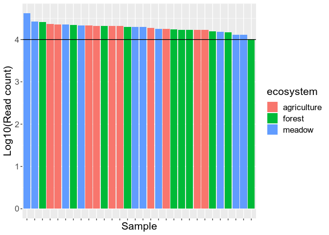

Examining βNTI across land use regimes
================
Samuel Barnett
06 December, 2019

## Introduction

In the following analysis, βNTI will be examined within land use
strategies to see if community assembly (deterministic vs. stochastic)
differs across land use. The βNTI will also be compared against
variation in soil parameters within each land use to see if phylogenetic
turnover correlates with these soil factors. βNTI values were calculated
in bNTI\_calculations.Rmd.

This analysis uses the same (-2, 2) range for significance testing as in
Stegen et al. 2012. This means that the following conclusison can be
drawn from this data: βNTI \> 2: Community assembly driven by variable
selection βNTI \< -2: Community assembly driven by homgenizing selection
|βNTI| \< 2: Community assembly is stochastic

### Initiate libraries

``` r
# Packages needed for analysis
library(dplyr)
library(tidyr)
library(tibble)
library(phyloseq)
library(geosphere)

# Packages needed for plotting
library(ggplot2)
library(grid)
library(gridExtra)
```

### Import data

``` r
# Import bulk soil phyloseq data
bulk.physeq = readRDS("/home/sam/data/fullCyc2_data/bulk_soil_physeq.RDS")

## Check how many reads you have in each of the samples. This will tell you if you need to re-do anything
# Get read counts and make a new dataframe with this data
read_count = data.frame("count" = colSums(otu_table(bulk.physeq))) %>%
  rownames_to_column(var="X.Sample") %>%
  inner_join(data.frame(sample_data(bulk.physeq)), by="X.Sample") %>%
  arrange(-count) %>%
  mutate(X.Sample=factor(X.Sample, levels=X.Sample))

# Now plot read count for each sample. The horizontal line represents a 2000 read threshold
ggplot(data=read_count, aes(x=X.Sample, y=log10(count), fill=ecosystem)) +
  geom_bar(stat="identity") +
  labs(x="Sample", y="Log10(Read count)") +
  geom_hline(yintercept=log10(10000)) +
  theme(text = element_text(size=16),
        axis.text.x = element_blank())
```

<!-- -->

``` r
# Everything seems to be at or above 10000 total reads

bulk.physeq
```

    ## phyloseq-class experiment-level object
    ## otu_table()   OTU Table:         [ 15112 taxa and 30 samples ]
    ## sample_data() Sample Data:       [ 30 samples by 30 sample variables ]
    ## tax_table()   Taxonomy Table:    [ 15112 taxa by 7 taxonomic ranks ]
    ## phy_tree()    Phylogenetic Tree: [ 15112 tips and 15111 internal nodes ]

Now we need to rarefy the data to normalize the sequencing depth. We
should also get a normalized dataset which gives relative abundance
rather than readcounts.

``` r
# Rarefy to an even depth
set.seed(72)  # setting seed for reproducibility
bulk.physeq.rare = rarefy_even_depth(bulk.physeq)

# Normalize read counts (this gives relative abundance)
bulk.physeq.norm = transform_sample_counts(bulk.physeq.rare, function(x) x/sum(x))
```

Now import the βNTI data generated in bNTI\_calculation.Rmd

``` r
# Import data
full.bNTI.df = read.table("/home/sam/data/fullCyc2_data/Final_data/community_assembly/full_bNTI.txt")
```

## βNTI across habitats

### Comparing βNTI between habitats

Now that we have calculated βNTI for pairwise sites within habitats,
lets see if there is any differences between land use regimes.

``` r
# get habitat metadata and add it to the βNTI data
eco.meta1=data.frame(sample_data(bulk.physeq.rare)) %>%
  select(X.Sample, ecosystem) %>%
  rename(Sample_1 = X.Sample, ecosystem_1 = ecosystem)
eco.meta2=data.frame(sample_data(bulk.physeq.rare)) %>%
  select(X.Sample, ecosystem) %>%
  rename(Sample_2 = X.Sample, ecosystem_2 = ecosystem)

bNTI.df = inner_join(full.bNTI.df, eco.meta1) %>%
  inner_join(eco.meta2) %>%
  filter(ecosystem_1 == ecosystem_2) %>%
  mutate(ecosystem = ecosystem_1)

bNTI.df$ecosystem = factor(bNTI.df$ecosystem, levels=c("agriculture", "meadow", "forest"))

bNTI.df %>% group_by(ecosystem) %>%
  dplyr::summarize(mean_bNTI = mean(bNTI),
            median_bNTI = median(bNTI))
```

    ## # A tibble: 3 x 3
    ##   ecosystem   mean_bNTI median_bNTI
    ##   <fct>           <dbl>       <dbl>
    ## 1 agriculture    -1.62        -2.03
    ## 2 meadow         -2.22        -2.50
    ## 3 forest         -0.749       -1.58

``` r
# Plot the βNTI values each ecosystem.
bNTI.plot = ggplot(bNTI.df, aes(x=ecosystem, y=bNTI)) +
  geom_boxplot() +
  geom_hline(yintercept = 2, linetype=2) +
  geom_hline(yintercept = -2, linetype=2) +
  labs(x="Land use", y="βNTI") +
  theme(legend.position = "none")

# How many site pairs are outside the -2,2 interval for each habitat?
select.bNTI.df = bNTI.df %>%
  mutate(selection = ifelse(bNTI < -2, "Homogeneous Selection",
                            ifelse(bNTI > 2, "Variable Selection", "Stochastic"))) %>%
  group_by(ecosystem, selection) %>%
  dplyr::summarize(n_pairs = n()) %>%
  mutate(perc = n_pairs/45)
select.bNTI.df$selection = factor(select.bNTI.df$selection, levels=c("Stochastic", "Variable Selection", "Homogeneous Selection"))
select.bNTI.df
```

    ## # A tibble: 9 x 4
    ## # Groups:   ecosystem [3]
    ##   ecosystem   selection             n_pairs   perc
    ##   <fct>       <fct>                   <int>  <dbl>
    ## 1 agriculture Homogeneous Selection      23 0.511 
    ## 2 agriculture Stochastic                 16 0.356 
    ## 3 agriculture Variable Selection          6 0.133 
    ## 4 meadow      Homogeneous Selection      27 0.6   
    ## 5 meadow      Stochastic                 16 0.356 
    ## 6 meadow      Variable Selection          2 0.0444
    ## 7 forest      Homogeneous Selection      22 0.489 
    ## 8 forest      Stochastic                 11 0.244 
    ## 9 forest      Variable Selection         12 0.267

``` r
selection.plot = ggplot(select.bNTI.df, aes(x=ecosystem, y=perc, fill=selection)) +
  geom_bar(stat="identity") +
  scale_fill_manual(values = c("grey", "#01BC2F", "#5E9AFF")) + 
  labs(x="Land use", y="Percent of site pairs", fill="Assembly process")
selection.plot
```

<!-- -->

``` r
# Are the average βNTI values different among habitats?
kruskal.test(bNTI ~ ecosystem, data = bNTI.df) 
```

    ## 
    ##  Kruskal-Wallis rank sum test
    ## 
    ## data:  bNTI by ecosystem
    ## Kruskal-Wallis chi-squared = 2.4182, df = 2, p-value = 0.2985

``` r
cowplot::plot_grid(bNTI.plot, selection.plot, rel_widths=c(.7, 1))
```

<!-- -->

Here we see that the median βNTI value for agriculture and meadow soils
are below -2 indicating that phylogenetic turnover in land use
strategies is significantly lower than expected by chance. This
indicates that these habitats are goverened primarily by homogeneous
selection processes. Forest on the other hand is above that value
indicating that it is more neutral. However, forest soils have a much
broader range of βNTI values

### βNTI across soil properties within each habitat

We have seen before with the CAP analysis that some soil properties,
mainly pH, SOC, and C:N, may drive community differences in these
habitats. Lets see if there is any relationship between any of these
soil properties and the βNTI in each habitat individually. If so, then
it may be these factors driving community assembly.

First we need a function for running the mantel test. This just makes
things easier later with less code.

``` r
Sams.mantel.test = function(df, seed=NULL) {
  # Run mantel test to see if there is a correlation
  delta.mat = df %>%
    select(Sample_1, Sample_2, delta) %>%
    spread(Sample_2, delta)
  rownames(delta.mat) = delta.mat$Sample_1
  delta.mat$Sample_1 = NULL
  delta.mat = delta.mat[names(sort(rowSums(!is.na(delta.mat)), decreasing = F)), names(sort(colSums(!is.na(delta.mat)), decreasing = T))]
  delta.mat = as.dist(delta.mat)
  
  bNTI.mat = df %>%
    select(Sample_1, Sample_2, bNTI) %>%
    spread(Sample_2, bNTI)
  rownames(bNTI.mat) = bNTI.mat$Sample_1
  bNTI.mat$Sample_1 = NULL
  bNTI.mat = bNTI.mat[names(sort(rowSums(!is.na(bNTI.mat)), decreasing = F)), names(sort(colSums(!is.na(bNTI.mat)), decreasing = T))]
  bNTI.mat = as.dist(bNTI.mat)
  if (!(is.null(seed))){
    set.seed(seed)
  }
  mantel.res = vegan::mantel(delta.mat, bNTI.mat)
  return(mantel.res)
}
```

### pH

First lets see if βNTI is correlated with the difference in pH between
sites within each land use.

``` r
# Get delta pH for all pairs
pH.meta1=data.frame(sample_data(bulk.physeq)) %>%
  select(X.Sample, pH) %>%
  rename(Sample_1 = X.Sample, pH_1 = pH)
pH.meta2=data.frame(sample_data(bulk.physeq.rare)) %>%
  select(X.Sample, pH) %>%
  rename(Sample_2 = X.Sample, pH_2 = pH)

bNTI.pH.df = inner_join(bNTI.df, pH.meta1) %>%
  inner_join(pH.meta2) %>%
  mutate(delta = abs(pH_1-pH_2))

# Run mantel test to see if there is a correlation
ag.pH.mantel = Sams.mantel.test(bNTI.pH.df %>% filter(ecosystem == "agriculture"), seed=72)
m.pH.mantel = Sams.mantel.test(bNTI.pH.df %>% filter(ecosystem == "meadow"), seed=72)
f.pH.mantel = Sams.mantel.test(bNTI.pH.df %>% filter(ecosystem == "forest"), seed=72)

pH.mantel.coef = data.frame(r = c(ag.pH.mantel$statistic, m.pH.mantel$statistic, f.pH.mantel$statistic),
                            p = c(ag.pH.mantel$signif, m.pH.mantel$signif, f.pH.mantel$signif),
                            ecosystem = c("agriculture", "meadow", "forest"))

# Plot
bNTI.pH.plot = ggplot(bNTI.pH.df, aes(x=delta, y=bNTI)) +
  geom_point() +
  geom_hline(yintercept = 2, linetype=2) +
  geom_hline(yintercept = -2, linetype=2) +
  geom_text(data=pH.mantel.coef, x=0.5, y=7, aes(label=paste("r = ", round(r, 3), "\n", "p = ", round(p, 3), sep=""))) +
  labs(x="Delta pH", y="βNTI") +
  theme(legend.position = "none") +
  facet_grid(~ecosystem)

bNTI.pH.plot
```

<!-- -->

There is a significant positive correlation between βNTI and difference
in pH between sites for all three land uses. For the most part, sites
with very similar pHs have a βNTI \< -2 suggesting homogeneous selection
pressure, while sites with very dissimilar pHs have a βNTI \> 2
suggesting varaible selection. The correlation is strongest in forest
soils and less so in agriculture.

### Soil organic matter

First lets see if βNTI is correlated with the difference in percent soil
organic matter between sites within each land use.

``` r
# Get delta % SOM for all pairs
SOC.meta1=data.frame(sample_data(bulk.physeq.rare)) %>%
  select(X.Sample, organic_content_perc) %>%
  rename(Sample_1 = X.Sample, SOC_1 = organic_content_perc)
SOC.meta2=data.frame(sample_data(bulk.physeq.rare)) %>%
  select(X.Sample, organic_content_perc) %>%
  rename(Sample_2 = X.Sample, SOC_2 = organic_content_perc)

bNTI.SOC.df = inner_join(bNTI.df, SOC.meta1) %>%
  inner_join(SOC.meta2) %>%
  mutate(delta = abs(SOC_1-SOC_2))

# Run mantel test to see if there is a correlation
ag.SOC.mantel = Sams.mantel.test(bNTI.SOC.df %>% filter(ecosystem == "agriculture"), seed=72)
m.SOC.mantel = Sams.mantel.test(bNTI.SOC.df %>% filter(ecosystem == "meadow"), seed=72)
f.SOC.mantel = Sams.mantel.test(bNTI.SOC.df %>% filter(ecosystem == "forest"), seed=72)

SOC.mantel.coef = data.frame(r = c(ag.SOC.mantel$statistic, m.SOC.mantel$statistic, f.SOC.mantel$statistic),
                            p = c(ag.SOC.mantel$signif, m.SOC.mantel$signif, f.SOC.mantel$signif),
                            ecosystem = c("agriculture", "meadow", "forest"))


# Plot
bNTI.SOC.plot = ggplot(bNTI.SOC.df, aes(x=delta, y=bNTI)) +
  geom_point() +
  geom_hline(yintercept = 2, linetype=2) +
  geom_hline(yintercept = -2, linetype=2) +
  geom_text(data=SOC.mantel.coef, x=0.095, y=-8, aes(label=paste("r= ", round(r, 3), "\n", "p= ", round(p, 3), sep=""))) +
  labs(x="Delta SOC (%)", y="βNTI") +
  theme(legend.position = "none") +
  facet_grid(~ecosystem)

bNTI.SOC.plot
```

<!-- -->

There is no significant correlation between βNTI and differenc in SOC in
any land use

### C:N Ratio

First lets see if βNTI is correlated with the difference in C:N ratio
between sites within each land use.

``` r
# Get delta C:N for all pairs
CN.meta1=data.frame(sample_data(bulk.physeq.rare)) %>%
  select(X.Sample, percent_N, percent_C) %>%
  rename(Sample_1 = X.Sample) %>%
  mutate(CN_1 = percent_C/percent_N) %>%
  select(-percent_N, -percent_C)
CN.meta2=data.frame(sample_data(bulk.physeq.rare)) %>%
  select(X.Sample, percent_N, percent_C) %>%
  rename(Sample_2 = X.Sample) %>%
  mutate(CN_2 = percent_C/percent_N) %>%
  select(-percent_N, -percent_C)

bNTI.CN.df = inner_join(bNTI.df, CN.meta1) %>%
  inner_join(CN.meta2) %>%
  mutate(delta = abs(CN_1-CN_2))

# Run mantel test to see if there is a correlation
ag.CN.mantel = Sams.mantel.test(bNTI.CN.df %>% filter(ecosystem == "agriculture"), seed=72)
m.CN.mantel = Sams.mantel.test(bNTI.CN.df %>% filter(ecosystem == "meadow"), seed=72)
f.CN.mantel = Sams.mantel.test(bNTI.CN.df %>% filter(ecosystem == "forest"), seed=72)

CN.mantel.coef = data.frame(r = c(ag.CN.mantel$statistic, m.CN.mantel$statistic, f.CN.mantel$statistic),
                            p = c(ag.CN.mantel$signif, m.CN.mantel$signif, f.CN.mantel$signif),
                            ecosystem = c("agriculture", "meadow", "forest"))

# Plot
bNTI.CN.plot = ggplot(bNTI.CN.df, aes(x=delta, y=bNTI)) +
  geom_point() +
  geom_hline(yintercept = 2, linetype=2) +
  geom_hline(yintercept = -2, linetype=2) +
  geom_text(data=CN.mantel.coef, x=5.5, y=-8, aes(label=paste("r= ", round(r, 3), "\n", "p= ", round(p, 3), sep=""))) +
  labs(x="Delta C:N", y="βNTI") +
  theme(legend.position = "none") +
  facet_grid(~ecosystem)

bNTI.CN.plot
```

<!-- -->

There is no significant relationship between βNTI and difference in C:N
ratio in any land use

### Percent Sand

First lets see if βNTI is correlated with the difference in percent sand
between sites within each land use.

``` r
# Get delta % sand for all pairs
sand.meta1=data.frame(sample_data(bulk.physeq.rare)) %>%
  select(X.Sample, sand__perc) %>%
  rename(Sample_1 = X.Sample, sand_1 = sand__perc)
sand.meta2=data.frame(sample_data(bulk.physeq.rare)) %>%
  select(X.Sample, sand__perc) %>%
  rename(Sample_2 = X.Sample, sand_2 = sand__perc)

bNTI.sand.df = inner_join(bNTI.df, sand.meta1) %>%
  inner_join(sand.meta2) %>%
  mutate(delta = abs(sand_1-sand_2))

# Run mantel test to see if there is a correlation
ag.sand.mantel = Sams.mantel.test(bNTI.sand.df %>% filter(ecosystem == "agriculture"), seed=72)
m.sand.mantel = Sams.mantel.test(bNTI.sand.df %>% filter(ecosystem == "meadow"), seed=72)
f.sand.mantel = Sams.mantel.test(bNTI.sand.df %>% filter(ecosystem == "forest"), seed=72)

sand.mantel.coef = data.frame(r = c(ag.sand.mantel$statistic, m.sand.mantel$statistic, f.sand.mantel$statistic),
                            p = c(ag.sand.mantel$signif, m.sand.mantel$signif, f.sand.mantel$signif),
                            ecosystem = c("agriculture", "meadow", "forest"))

# Plot
bNTI.sand.plot = ggplot(bNTI.sand.df, aes(x=delta, y=bNTI)) +
  geom_point() +
  geom_hline(yintercept = 2, linetype=2) +
  geom_hline(yintercept = -2, linetype=2) +
  geom_text(data=sand.mantel.coef, x=57, y=7, aes(label=paste("r= ", round(r, 3), "\n", "p= ", round(p, 3), sep=""))) +
  labs(x="Delta sand (%)", y="βNTI") +
  theme(legend.position = "none") +
  facet_grid(~ecosystem)

bNTI.sand.plot
```

<!-- -->

There is no significant relationship between βNTI and difference in sand
content in any land use.

### Geographic distance

First lets see if βNTI is correlated with the geographic distance
between sites within each land use.

``` r
# Get the geographic distances
geodist.meta1 = data.frame(sample_data(bulk.physeq.rare)) %>%
  select(X.Sample, longitude, latitude) %>%
  rename(Sample_1 = X.Sample, longitude1 = longitude, latitude1 = latitude)
geodist.meta2 = data.frame(sample_data(bulk.physeq.rare)) %>%
  select(X.Sample, longitude, latitude) %>%
  rename(Sample_2 = X.Sample, longitude2 = longitude, latitude2 = latitude)

bNTI.geodist.df = inner_join(bNTI.df, geodist.meta1) %>%
  inner_join(geodist.meta2)

Coord1.mat = as.matrix(bNTI.geodist.df %>% select(longitude1, latitude1))
Coord2.mat = as.matrix(bNTI.geodist.df %>% select(longitude2, latitude2))

bNTI.geodist.df$delta = distHaversine(Coord1.mat, Coord2.mat)/1000

# Run mantel test to see if there is a correlation
ag.geodist.mantel = Sams.mantel.test(bNTI.geodist.df %>% filter(ecosystem == "agriculture"), seed=72)
m.geodist.mantel = Sams.mantel.test(bNTI.geodist.df %>% filter(ecosystem == "meadow"), seed=72)
f.geodist.mantel = Sams.mantel.test(bNTI.geodist.df %>% filter(ecosystem == "forest"), seed=72)

geodist.mantel.coef = data.frame(r = c(ag.geodist.mantel$statistic, m.geodist.mantel$statistic, f.geodist.mantel$statistic),
                            p = c(ag.geodist.mantel$signif, m.geodist.mantel$signif, f.geodist.mantel$signif),
                            ecosystem = c("agriculture", "meadow", "forest"))

# Plot
bNTI.geodist.plot = ggplot(bNTI.geodist.df, aes(x=delta, y=bNTI)) +
  geom_point() +
  geom_hline(yintercept = 2, linetype=2) +
  geom_hline(yintercept = -2, linetype=2) +
  geom_text(data=geodist.mantel.coef, x=10, y=8, aes(label=paste("r= ", round(r, 3), "\n", "p= ", round(p, 3), sep=""))) +
  labs(x="Geographic distance (km)", y="βNTI") +
  theme(legend.position = "none") +
  facet_grid(~ecosystem)

bNTI.geodist.plot
```

<!-- -->

There is no significant relationship between βNTI and geographic
distance in any land use

### Figure for manuscript: pH

For the manuscript we want a figure showing the correlation between
difference in pH across samples and βNTI for each land use and the
entire region. The analysis looking across the entire region can also be
found in bNTI\_soil\_properties.Rmd.

#### βNTI vs. ∆pH across the region

We saw that delta pH was significantly correlated with βNTI and strongly
across the entire region (see bNTI\_soil\_properties.Rmd). Lets rerun
that analysis here so we can put it in the figure.

``` r
# Land use shapes
LandUse.shapes = c("agriculture" = 15, "meadow" = 16, "forest" = 17, "across" = 5)

# get land use metadata and add it to the βNTI data
eco.meta1=data.frame(sample_data(bulk.physeq.rare)) %>%
  select(X.Sample, ecosystem) %>%
  rename(Sample_1 = X.Sample, ecosystem_1 = ecosystem)
eco.meta2=data.frame(sample_data(bulk.physeq.rare)) %>%
  select(X.Sample, ecosystem) %>%
  rename(Sample_2 = X.Sample, ecosystem_2 = ecosystem)

# get pH metadata and add it to the βNTI data
pH.meta1=data.frame(sample_data(bulk.physeq.rare)) %>%
  select(X.Sample, pH) %>%
  rename(Sample_1 = X.Sample, pH_1 = pH)
pH.meta2=data.frame(sample_data(bulk.physeq.rare)) %>%
  select(X.Sample, pH) %>%
  rename(Sample_2 = X.Sample, pH_2 = pH)

full.bNTI.pH.df = inner_join(full.bNTI.df, pH.meta1) %>%
  inner_join(pH.meta2) %>%
  inner_join(eco.meta1) %>%
  inner_join(eco.meta2) %>%
  mutate(delta = abs(pH_1-pH_2),
         crosstype = ifelse(ecosystem_1 == ecosystem_2, as.character(ecosystem_1), "across"))

# Run mantel test to see if there is a correlation
pH.mantel = Sams.mantel.test(full.bNTI.pH.df, seed=72)


# Plot
full.bNTI.pH.plot = ggplot(full.bNTI.pH.df, aes(x=delta, y=bNTI)) +
  geom_point(aes(shape=crosstype), size=3) +
  scale_shape_manual(values=LandUse.shapes) +
  geom_hline(yintercept = 2, linetype=2) +
  geom_hline(yintercept = -2, linetype=2) +
  ylim(-10, 14) +
  xlim(0, 3.75) +
  annotate("text", x=0.75, y=11, size=4,
           label=paste("r = ", round(pH.mantel$statistic, 3), "\n", "p = ", round(pH.mantel$signif, 3), sep="")) +
  labs(x="Delta pH", y="βNTI") +
  theme_bw() +
  theme(legend.position = "none",
        legend.text = element_text(size=12),
        legend.title = element_text(size=12),
        axis.text = element_text(size=12),
        axis.title=element_blank(),
        plot.margin = unit(c(7,1,1,5), "mm"))
```

#### βNTI vs. ∆ pH within each habitat

Lets just run the analysis we ran before looking at ∆pH within the land
use regimes again so that we can add it to the figure.

``` r
# Land use shapes
LandUse.shapes = c("agriculture" = 15, "meadow" = 16, "forest" = 17)

# Get delta pH for all pairs
pH.meta1=data.frame(sample_data(bulk.physeq)) %>%
  select(X.Sample, pH) %>%
  rename(Sample_1 = X.Sample, pH_1 = pH)
pH.meta2=data.frame(sample_data(bulk.physeq.rare)) %>%
  select(X.Sample, pH) %>%
  rename(Sample_2 = X.Sample, pH_2 = pH)

bNTI.pH.df = inner_join(bNTI.df, pH.meta1) %>%
  inner_join(pH.meta2) %>%
  mutate(delta = abs(pH_1-pH_2))

# Run mantel test to see if there is a correlation
ag.pH.mantel = Sams.mantel.test(bNTI.pH.df %>% filter(ecosystem == "agriculture"), seed=72)
m.pH.mantel = Sams.mantel.test(bNTI.pH.df %>% filter(ecosystem == "meadow"), seed=72)
f.pH.mantel = Sams.mantel.test(bNTI.pH.df %>% filter(ecosystem == "forest"), seed=72)

pH.mantel.coef = data.frame(r = c(ag.pH.mantel$statistic, m.pH.mantel$statistic, f.pH.mantel$statistic),
                            p = c(ag.pH.mantel$signif, m.pH.mantel$signif, f.pH.mantel$signif),
                            ecosystem = c("agriculture", "meadow", "forest"))


# Plot
bNTI.pH.plot.list = list()
for (habitat in unique(bNTI.pH.df$ecosystem)){
  sub.mantel = pH.mantel.coef[pH.mantel.coef$ecosystem==habitat,]
  bNTI.pH.plot.list[[habitat]] = ggplot(bNTI.pH.df[bNTI.pH.df$ecosystem == habitat,], aes(x=delta, y=bNTI)) +
    geom_point(aes(shape=ecosystem), size=3) +
    scale_shape_manual(values=LandUse.shapes) +
    geom_hline(yintercept = 2, linetype=2) +
    geom_hline(yintercept = -2, linetype=2) +
    ylim(-10, 14) +
    xlim(0, 3.75) +
    annotate("text", x=0.75, y=11, label=paste("r = ", round(sub.mantel$r, 3), "\n", "p = ", round(sub.mantel$p, 3), sep=""),
             size=4) +
    labs(x="Delta pH", y="βNTI") +
    theme_bw() +
    theme(legend.position = "none",
          legend.text = element_text(size=12),
          legend.title = element_text(size=12),
          axis.text = element_text(size=12),
          axis.title=element_blank(),
          plot.margin = unit(c(7,1,1,5), "mm"))
}
```

#### Merge figures

Now put all the figures together into a publication quality figure.

``` r
# Plot together
bNTI.pH.plot = cowplot::plot_grid(full.bNTI.pH.plot, bNTI.pH.plot.list[["agriculture"]],
                                  bNTI.pH.plot.list[["meadow"]], bNTI.pH.plot.list[["forest"]],
                                  nrow = 2, ncol=2, labels=c("A", "B", "C", "D"))

y.grob <- textGrob("βNTI", 
                   gp=gpar(fontsize=15), rot=90)

x.grob <- textGrob("∆pH between sites", 
                   gp=gpar(fontsize=15))

bNTI.ph.full.plot = arrangeGrob(bNTI.pH.plot, left = y.grob, bottom = x.grob)
plot(bNTI.ph.full.plot)
```

<!-- -->

``` r
#ggsave("bNTI_pH.tiff", plot=bNTI.ph.full.plot, device="tiff", 
#       path="/home/sam/notebooks/fullCyc2/figures/community_assembly_MS/",
#       width=168, height=168, units="mm", dpi=600)
```

## Session Info

``` r
sessionInfo()
```

    ## R version 3.4.4 (2018-03-15)
    ## Platform: x86_64-pc-linux-gnu (64-bit)
    ## Running under: Ubuntu 18.04.3 LTS
    ## 
    ## Matrix products: default
    ## BLAS: /usr/lib/x86_64-linux-gnu/blas/libblas.so.3.7.1
    ## LAPACK: /usr/lib/x86_64-linux-gnu/lapack/liblapack.so.3.7.1
    ## 
    ## locale:
    ##  [1] LC_CTYPE=en_US.UTF-8       LC_NUMERIC=C              
    ##  [3] LC_TIME=en_US.UTF-8        LC_COLLATE=en_US.UTF-8    
    ##  [5] LC_MONETARY=en_US.UTF-8    LC_MESSAGES=en_US.UTF-8   
    ##  [7] LC_PAPER=en_US.UTF-8       LC_NAME=C                 
    ##  [9] LC_ADDRESS=C               LC_TELEPHONE=C            
    ## [11] LC_MEASUREMENT=en_US.UTF-8 LC_IDENTIFICATION=C       
    ## 
    ## attached base packages:
    ## [1] grid      stats     graphics  grDevices utils     datasets  methods  
    ## [8] base     
    ## 
    ## other attached packages:
    ## [1] gridExtra_2.3    ggplot2_3.2.1    geosphere_1.5-10 phyloseq_1.22.3 
    ## [5] tibble_2.1.3     tidyr_1.0.0      dplyr_0.8.3     
    ## 
    ## loaded via a namespace (and not attached):
    ##  [1] Rcpp_1.0.2          ape_5.3             lattice_0.20-38    
    ##  [4] Biostrings_2.46.0   utf8_1.1.4          assertthat_0.2.1   
    ##  [7] zeallot_0.1.0       digest_0.6.21       foreach_1.4.7      
    ## [10] R6_2.4.0            plyr_1.8.4          backports_1.1.5    
    ## [13] stats4_3.4.4        evaluate_0.14       pillar_1.4.2       
    ## [16] zlibbioc_1.24.0     rlang_0.4.0         lazyeval_0.2.2     
    ## [19] data.table_1.12.4   vegan_2.5-6         S4Vectors_0.16.0   
    ## [22] Matrix_1.2-17       rmarkdown_1.16      labeling_0.3       
    ## [25] splines_3.4.4       stringr_1.4.0       igraph_1.2.4.1     
    ## [28] munsell_0.5.0       compiler_3.4.4      xfun_0.10          
    ## [31] pkgconfig_2.0.3     BiocGenerics_0.24.0 multtest_2.34.0    
    ## [34] mgcv_1.8-31         htmltools_0.4.0     biomformat_1.6.0   
    ## [37] tidyselect_0.2.5    IRanges_2.12.0      codetools_0.2-16   
    ## [40] fansi_0.4.0         permute_0.9-5       crayon_1.3.4       
    ## [43] withr_2.1.2         MASS_7.3-51.4       nlme_3.1-142       
    ## [46] jsonlite_1.6        gtable_0.3.0        lifecycle_0.1.0    
    ## [49] magrittr_1.5        scales_1.0.0        cli_1.1.0          
    ## [52] stringi_1.4.3       XVector_0.18.0      reshape2_1.4.3     
    ## [55] sp_1.3-1            vctrs_0.2.0         cowplot_0.9.2      
    ## [58] iterators_1.0.12    tools_3.4.4         ade4_1.7-13        
    ## [61] Biobase_2.38.0      glue_1.3.1          purrr_0.3.2        
    ## [64] parallel_3.4.4      survival_3.1-7      yaml_2.2.0         
    ## [67] colorspace_1.4-1    rhdf5_2.22.0        cluster_2.1.0      
    ## [70] knitr_1.25
