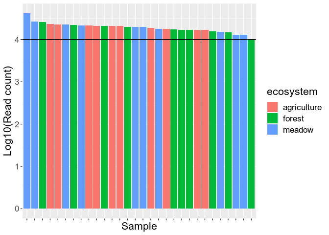
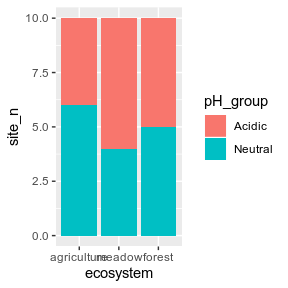
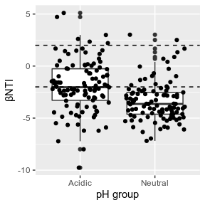
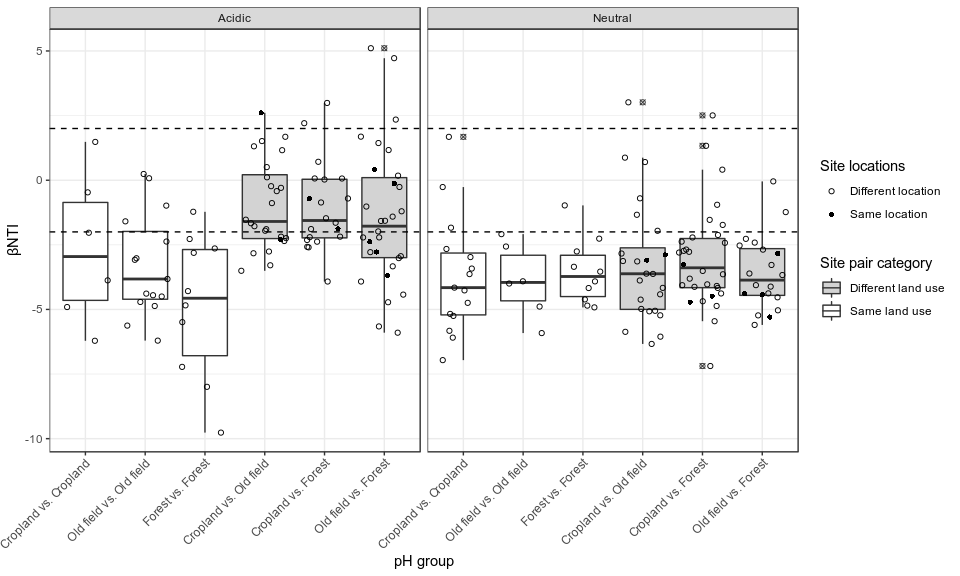

Examining βNTI across pH groups
================
Samuel Barnett
06 December, 2019

## Introduction

In the following analysis, βNTI will be examined within pH groups
(acidic and neutral soils) to see if community assembly (deterministic
vs. stochastic) differs across soil pH group. βNTI values were
calculated in bNTI\_calculations.Rmd.

This analysis uses the same (-2, 2) range for significance testing as in
Stegen et al. 2012. This means that the following conclusison can be
drawn from this data: βNTI \> 2: Community assembly driven by variable
selection βNTI \< -2: Community assembly driven by homgenizing selection
|βNTI| \< 2: Community assembly is stochastic

### Initiate libraries

``` r
# Packages needed for analysis
library(dplyr)
library(tidyr)
library(tibble)
library(phyloseq)
library(geosphere)

# Packages needed for plotting
library(ggplot2)
library(grid)
library(gridExtra)
```

### Import data

``` r
# Import bulk soil phyloseq data
bulk.physeq = readRDS("/home/sam/data/fullCyc2_data/bulk_soil_physeq.RDS")

## Check how many reads you have in each of the samples. This will tell you if you need to re-do anything
# Get read counts and make a new dataframe with this data
read_count = data.frame("count" = colSums(otu_table(bulk.physeq))) %>%
  rownames_to_column(var="X.Sample") %>%
  inner_join(data.frame(sample_data(bulk.physeq)), by="X.Sample") %>%
  arrange(-count) %>%
  mutate(X.Sample=factor(X.Sample, levels=X.Sample))

# Now plot read count for each sample. The horizontal line represents a 2000 read threshold
ggplot(data=read_count, aes(x=X.Sample, y=log10(count), fill=ecosystem)) +
  geom_bar(stat="identity") +
  labs(x="Sample", y="Log10(Read count)") +
  geom_hline(yintercept=log10(10000)) +
  theme(text = element_text(size=16),
        axis.text.x = element_blank())
```

<!-- -->

``` r
# Everything seems to be at or above 10000 total reads

bulk.physeq
```

    ## phyloseq-class experiment-level object
    ## otu_table()   OTU Table:         [ 15112 taxa and 30 samples ]
    ## sample_data() Sample Data:       [ 30 samples by 30 sample variables ]
    ## tax_table()   Taxonomy Table:    [ 15112 taxa by 7 taxonomic ranks ]
    ## phy_tree()    Phylogenetic Tree: [ 15112 tips and 15111 internal nodes ]

Now we need to rarefy the data to normalize the sequencing depth. We
should also get a normalized dataset which gives relative abundance
rather than readcounts.

``` r
# Rarefy to an even depth
set.seed(72)  # setting seed for reproducibility
bulk.physeq.rare = rarefy_even_depth(bulk.physeq)

# Normalize read counts (this gives relative abundance)
bulk.physeq.norm = transform_sample_counts(bulk.physeq.rare, function(x) x/sum(x))
```

Now import the βNTI data generated in bNTI\_calculation.Rmd

``` r
# Import data
full.bNTI.df = read.table("/home/sam/data/fullCyc2_data/Final_data/community_assembly/full_bNTI.txt")
```

## βNTI between pH groups

For the analysis of the neutral models we grouped samples based on their
pH. These two groups consisted of: Acidic soils: pH ≤ 5.5 pH neutral
soils: 5.5 \< pH \< 8.5 Alkaline soils: pH ≥ 8.5

First, how do the land use regimes split up into these groups. We dont
want one pH group to contain too many of a single land use.

``` r
pH.meta.sum = data.frame(sample_data(bulk.physeq.rare)) %>%
  select(X.Sample, ecosystem, pH) %>%
  mutate(pH_group = ifelse(pH <= 5.5, "Acidic", 
                           ifelse(pH >= 8.5, "Alkaline", "Neutral"))) %>%
  group_by(ecosystem, pH_group) %>%
  summarize(site_n = n()) %>%
  as.data.frame

pH.meta.sum$ecosystem = factor(pH.meta.sum$ecosystem, levels = c("agriculture", "meadow", "forest"))
pH.meta.sum$pH_group = factor(pH.meta.sum$pH_group, levels = c("Acidic", "Neutral", "Alkaline"))
pH.meta.sum
```

    ##     ecosystem pH_group site_n
    ## 1 agriculture   Acidic      4
    ## 2 agriculture  Neutral      6
    ## 3      forest   Acidic      5
    ## 4      forest  Neutral      5
    ## 5      meadow   Acidic      6
    ## 6      meadow  Neutral      4

``` r
ggplot(data=pH.meta.sum, aes(x=ecosystem, y=site_n, fill=pH_group)) +
  geom_bar(stat="identity")
```

<!-- -->

### Comparing βNTI between pH groups

Do these two pH groups differ in their phylogenetic turnover?

``` r
# Assign pH groups
# get pH metadata and add it to the βNTI data
pH.meta1=data.frame(sample_data(bulk.physeq.rare)) %>%
  select(X.Sample, pH) %>%
  rename(Sample_1 = X.Sample, pH_1 = pH) %>%
  mutate(pH_group_1 = ifelse(pH_1 <= 5.5, "Acidic", "Neutral"))
pH.meta2=data.frame(sample_data(bulk.physeq.rare)) %>%
  select(X.Sample, pH) %>%
  rename(Sample_2 = X.Sample, pH_2 = pH) %>%
  mutate(pH_group_2 = ifelse(pH_2 <= 5.5, "Acidic", "Neutral"))

pH.bNTI.df = inner_join(full.bNTI.df, pH.meta1) %>%
  inner_join(pH.meta2) %>%
  filter(pH_group_1 == pH_group_2) %>%
  mutate(pH_group = pH_group_1) %>%
  mutate(contrast = paste(Sample_1, Sample_2, sep="-VS-"))

pH.bNTI.df$pH_group = factor(pH.bNTI.df$pH_group, levels=c("Acidic", "Neutral"))

pH.bNTI.df %>% group_by(pH_group) %>%
  dplyr::summarize(mean_bNTI = mean(bNTI),
            median_bNTI = median(bNTI)) %>%
  as.data.frame
```

    ##   pH_group mean_bNTI median_bNTI
    ## 1   Acidic -1.908933   -2.032354
    ## 2  Neutral -3.370495   -3.639546

``` r
# Plot the βNTI data for each pH_group
pH.bNTI.plot = ggplot(pH.bNTI.df, aes(x=pH_group, y=bNTI)) +
  geom_boxplot() +
  geom_jitter() +
  geom_hline(yintercept = 2, linetype=2) +
  geom_hline(yintercept = -2, linetype=2) +
  labs(x="pH group", y="βNTI") +
  theme(legend.position = "none")

pH.bNTI.plot
```

<!-- -->

``` r
# How many site pairs are outside the -2,2 interval for each habitat?
pH.bNTI.df %>%
  mutate(selection = ifelse(bNTI < -2, "Homogeneous",
                            ifelse(bNTI > 2, "Variable", "Stocastic"))) %>%
  group_by(pH_group, selection) %>%
  dplyr::summarize(n_pairs = n()) %>%
  mutate(percent = n_pairs/105) %>%
  as.data.frame
```

    ##   pH_group   selection n_pairs    percent
    ## 1   Acidic Homogeneous      53 0.50476190
    ## 2   Acidic   Stocastic      46 0.43809524
    ## 3   Acidic    Variable       6 0.05714286
    ## 4  Neutral Homogeneous      87 0.82857143
    ## 5  Neutral   Stocastic      16 0.15238095
    ## 6  Neutral    Variable       2 0.01904762

``` r
# Are the average βNTI values different among habitats?
kruskal.test(bNTI ~ pH_group, data = pH.bNTI.df) 
```

    ## 
    ##  Kruskal-Wallis rank sum test
    ## 
    ## data:  bNTI by pH_group
    ## Kruskal-Wallis chi-squared = 25.964, df = 1, p-value = 3.478e-07

Interestingly we see that acidic soils tend to be more stochastic than
pH neutral soils. In fact, the βNTI values are significantly different
from eachother. However, neither group has a median βNTI outside of the
(-2,2) significance threshold. While on the whole, acidic soils tend to
be more stochastic, there is a much higher involvement of variable
selection in them as compared to pH neutral soils.

### Comparing βNTI between pH groups and land use regimes

Lets see if there is any interaction between land use regime and the pH
group on βNTI

``` r
# get habitat metadata and add it to the βNTI data
eco.meta1=data.frame(sample_data(bulk.physeq.rare)) %>%
  select(X.Sample, ecosystem, location) %>%
  rename(Sample_1 = X.Sample, ecosystem_1 = ecosystem, location_1 = location)
eco.meta2=data.frame(sample_data(bulk.physeq.rare)) %>%
  select(X.Sample, ecosystem, location) %>%
  rename(Sample_2 = X.Sample, ecosystem_2 = ecosystem, location_2 = location)

eco.pH.bNTI.df = inner_join(pH.bNTI.df, eco.meta1) %>%
  inner_join(eco.meta2) %>%
  mutate(LandUse_1 = ifelse(ecosystem_1 == "agriculture" | ecosystem_2 == "agriculture", "Cropland",
                            ifelse(ecosystem_1 == "meadow" | ecosystem_2 == "meadow", "Old field", "Forest"))) %>%
  mutate(LandUse_2 = ifelse(ecosystem_1 == ecosystem_2, LandUse_1,
                            ifelse(LandUse_1 == "Cropland",
                                   ifelse(ecosystem_1 == "meadow" | ecosystem_2 == "meadow", "Old field", "Forest"),
                                   "Forest"))) %>%
  mutate(LandUse_cross = paste(LandUse_1, LandUse_2, sep=" vs. "),
         Location_diff = ifelse(location_1 == location_2, "Same location", "Different location"),
         LandUse_diff = ifelse(LandUse_1 == LandUse_2, "Same land use", "Different land use")) %>%
  arrange(ecosystem_1, ecosystem_2)
eco.pH.bNTI.df$LandUse_cross = factor(eco.pH.bNTI.df$LandUse_cross, levels = c("Cropland vs. Cropland", "Old field vs. Old field", "Forest vs. Forest",
                                                                               "Cropland vs. Old field", "Cropland vs. Forest", "Old field vs. Forest"))

# Plot the βNTI data for each pH_group
eco.pH.bNTI.plot = ggplot(eco.pH.bNTI.df, aes(x=LandUse_cross, y=bNTI)) +
  geom_boxplot(aes(fill=LandUse_diff), outlier.shape=13) +
  geom_jitter(aes(shape=Location_diff)) +
  scale_fill_manual(values=c("lightgrey", "white")) +
  scale_shape_manual(values=c(1, 16)) +
  geom_hline(yintercept = 2, linetype=2) +
  geom_hline(yintercept = -2, linetype=2) +
  labs(x="pH group", y="βNTI", fill="Site pair category", shape="Site locations") +
  facet_grid(~pH_group) +
  theme_bw() +
  theme(axis.text.x = element_text(angle=45, hjust=1))

eco.pH.bNTI.plot
```

<!-- -->

So we are seeing some interaction between land use and pH group,
particularly in acidic soils where samples from different land uses seem
to be more stochastic, while all the rest are primarily homogenous
selection.

## Session info

``` r
sessionInfo()
```

    ## R version 3.4.4 (2018-03-15)
    ## Platform: x86_64-pc-linux-gnu (64-bit)
    ## Running under: Ubuntu 18.04.3 LTS
    ## 
    ## Matrix products: default
    ## BLAS: /usr/lib/x86_64-linux-gnu/blas/libblas.so.3.7.1
    ## LAPACK: /usr/lib/x86_64-linux-gnu/lapack/liblapack.so.3.7.1
    ## 
    ## locale:
    ##  [1] LC_CTYPE=en_US.UTF-8       LC_NUMERIC=C              
    ##  [3] LC_TIME=en_US.UTF-8        LC_COLLATE=en_US.UTF-8    
    ##  [5] LC_MONETARY=en_US.UTF-8    LC_MESSAGES=en_US.UTF-8   
    ##  [7] LC_PAPER=en_US.UTF-8       LC_NAME=C                 
    ##  [9] LC_ADDRESS=C               LC_TELEPHONE=C            
    ## [11] LC_MEASUREMENT=en_US.UTF-8 LC_IDENTIFICATION=C       
    ## 
    ## attached base packages:
    ## [1] grid      stats     graphics  grDevices utils     datasets  methods  
    ## [8] base     
    ## 
    ## other attached packages:
    ## [1] gridExtra_2.3    ggplot2_3.2.1    geosphere_1.5-10 phyloseq_1.22.3 
    ## [5] tibble_2.1.3     tidyr_1.0.0      dplyr_0.8.3     
    ## 
    ## loaded via a namespace (and not attached):
    ##  [1] tidyselect_0.2.5    xfun_0.10           reshape2_1.4.3     
    ##  [4] purrr_0.3.2         splines_3.4.4       lattice_0.20-38    
    ##  [7] rhdf5_2.22.0        colorspace_1.4-1    vctrs_0.2.0        
    ## [10] htmltools_0.4.0     stats4_3.4.4        mgcv_1.8-31        
    ## [13] yaml_2.2.0          survival_3.1-7      rlang_0.4.0        
    ## [16] pillar_1.4.2        withr_2.1.2         glue_1.3.1         
    ## [19] sp_1.3-1            BiocGenerics_0.24.0 foreach_1.4.7      
    ## [22] lifecycle_0.1.0     plyr_1.8.4          stringr_1.4.0      
    ## [25] zlibbioc_1.24.0     Biostrings_2.46.0   munsell_0.5.0      
    ## [28] gtable_0.3.0        codetools_0.2-16    evaluate_0.14      
    ## [31] labeling_0.3        Biobase_2.38.0      knitr_1.25         
    ## [34] permute_0.9-5       IRanges_2.12.0      biomformat_1.6.0   
    ## [37] parallel_3.4.4      Rcpp_1.0.2          backports_1.1.5    
    ## [40] scales_1.0.0        vegan_2.5-6         S4Vectors_0.16.0   
    ## [43] jsonlite_1.6        XVector_0.18.0      digest_0.6.21      
    ## [46] stringi_1.4.3       ade4_1.7-13         tools_3.4.4        
    ## [49] magrittr_1.5        lazyeval_0.2.2      cluster_2.1.0      
    ## [52] crayon_1.3.4        ape_5.3             pkgconfig_2.0.3    
    ## [55] zeallot_0.1.0       MASS_7.3-51.4       Matrix_1.2-17      
    ## [58] data.table_1.12.4   assertthat_0.2.1    rmarkdown_1.16     
    ## [61] iterators_1.0.12    R6_2.4.0            multtest_2.34.0    
    ## [64] igraph_1.2.4.1      nlme_3.1-142        compiler_3.4.4
