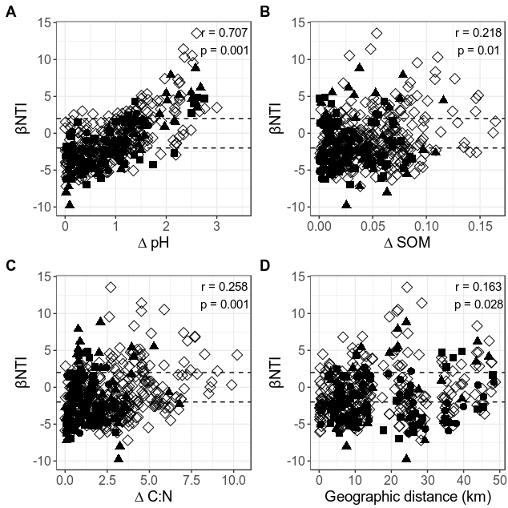

Comparing βNTI and soil properties across the whole region
================
Samuel Barnett
06 December, 2019

## Introduction

In this notebook, we will use the βNTI values calculated in
bNTI\_calculations.Rmd and see if they correlate with difference is
various soil properties across all 30 soil samples. A correlation would
indicate that the property is a driver of deterministic community
assembly across the region.

This analysis uses the same (-2, 2) range for significance testing as in
Stegen et al. 2012. This means that the following conclusison can be
drawn from this data: βNTI \> 2: Community assembly driven by variable
selection βNTI \< -2: Community assembly driven by homgenizing selection
|βNTI| \< 2: Community assembly is stochastic

### Initiate libraries

``` r
# Packages needed for analysis
library(dplyr)
library(tidyr)
library(tibble)
library(phyloseq)
library(geosphere)

# Packages needed for plotting
library(ggplot2)
```

### Import data

``` r
# Import bulk soil phyloseq data
bulk.physeq = readRDS("/home/sam/data/fullCyc2_data/bulk_soil_physeq.RDS")

## Check how many reads you have in each of the samples. This will tell you if you need to re-do anything
# Get read counts and make a new dataframe with this data
read_count = data.frame("count" = colSums(otu_table(bulk.physeq))) %>%
  rownames_to_column(var="X.Sample") %>%
  inner_join(data.frame(sample_data(bulk.physeq)), by="X.Sample") %>%
  arrange(-count) %>%
  mutate(X.Sample=factor(X.Sample, levels=X.Sample))

# Now plot read count for each sample. The horizontal line represents a 2000 read threshold
ggplot(data=read_count, aes(x=X.Sample, y=log10(count), fill=ecosystem)) +
  geom_bar(stat="identity") +
  labs(x="Sample", y="Log10(Read count)") +
  geom_hline(yintercept=log10(10000)) +
  theme(text = element_text(size=16),
        axis.text.x = element_blank())
```

<!-- -->

``` r
# Everything seems to be at or above 10000 total reads

bulk.physeq
```

    ## phyloseq-class experiment-level object
    ## otu_table()   OTU Table:         [ 15112 taxa and 30 samples ]
    ## sample_data() Sample Data:       [ 30 samples by 30 sample variables ]
    ## tax_table()   Taxonomy Table:    [ 15112 taxa by 7 taxonomic ranks ]
    ## phy_tree()    Phylogenetic Tree: [ 15112 tips and 15111 internal nodes ]

Now we need to rarefy the data to normalize the sequencing depth. We
should also get a normalized dataset which gives relative abundance
rather than readcounts.

``` r
# Rarefy to an even depth
set.seed(72)  # setting seed for reproducibility
bulk.physeq.rare = rarefy_even_depth(bulk.physeq)

# Normalize read counts (this gives relative abundance)
bulk.physeq.norm = transform_sample_counts(bulk.physeq.rare, function(x) x/sum(x))
```

Now import the βNTI data generated in bNTI\_calculation.Rmd

``` r
# Import data
full.bNTI.df = read.table("/home/sam/data/fullCyc2_data/Final_data/community_assembly/full_bNTI.txt")
```

## βNTI across soil parameters.

Lets see if there is a correlation between βNTI and some of the soil
parameters measured.

First we need a function for running the mantel test. This just makes
things easier later with less code.

``` r
Sams.mantel.test = function(df, seed=NULL) {
  # Run mantel test to see if there is a correlation
  delta.mat = df %>%
    select(Sample_1, Sample_2, delta) %>%
    spread(Sample_2, delta)
  rownames(delta.mat) = delta.mat$Sample_1
  delta.mat$Sample_1 = NULL
  delta.mat = delta.mat[names(sort(rowSums(!is.na(delta.mat)), decreasing = F)), names(sort(colSums(!is.na(delta.mat)), decreasing = T))]
  delta.mat = as.dist(delta.mat)
  
  bNTI.mat = df %>%
    select(Sample_1, Sample_2, bNTI) %>%
    spread(Sample_2, bNTI)
  rownames(bNTI.mat) = bNTI.mat$Sample_1
  bNTI.mat$Sample_1 = NULL
  bNTI.mat = bNTI.mat[names(sort(rowSums(!is.na(bNTI.mat)), decreasing = F)), names(sort(colSums(!is.na(bNTI.mat)), decreasing = T))]
  bNTI.mat = as.dist(bNTI.mat)
  if (!(is.null(seed))){
    set.seed(seed)
  }
  mantel.res = vegan::mantel(delta.mat, bNTI.mat)
  return(mantel.res)
}
```

I also want to add the ecosystem type to the βNTI dataframe so that I
can see whether we are comparing between the same or different land use
strategies.

``` r
# Land use shapes
LandUse.shapes = c("agriculture" = 15, "meadow" = 16, "forest" = 17, "across" = 5)

# get habitat metadata and add it to the βNTI data
eco.meta1=data.frame(sample_data(bulk.physeq.rare)) %>%
  select(X.Sample, ecosystem) %>%
  rename(Sample_1 = X.Sample, ecosystem_1 = ecosystem)
eco.meta2=data.frame(sample_data(bulk.physeq.rare)) %>%
  select(X.Sample, ecosystem) %>%
  rename(Sample_2 = X.Sample, ecosystem_2 = ecosystem)

full.eco.bNTI.df = inner_join(full.bNTI.df, eco.meta1) %>%
  inner_join(eco.meta2)
```

### pH

First lets see if βNTI is correlated with the difference in pH between
sites.

``` r
# Add in pH metadata
pH.meta1=data.frame(sample_data(bulk.physeq.rare)) %>%
  select(X.Sample, pH) %>%
  rename(Sample_1 = X.Sample, pH_1 = pH)
pH.meta2=data.frame(sample_data(bulk.physeq.rare)) %>%
  select(X.Sample, pH) %>%
  rename(Sample_2 = X.Sample, pH_2 = pH)

full.bNTI.pH.df = inner_join(full.eco.bNTI.df, pH.meta1) %>%
  inner_join(pH.meta2) %>%
  mutate(delta = abs(pH_1-pH_2),
         crosstype = ifelse(ecosystem_1 == ecosystem_2, as.character(ecosystem_1), "across"))

# Run mantel test to see if there is a correlation
pH.mantel = Sams.mantel.test(full.bNTI.pH.df, seed=72)

# Plot
full.bNTI.pH.plot = ggplot(full.bNTI.pH.df, aes(x=delta, y=bNTI)) +
  geom_point(aes(shape=crosstype)) +
  scale_shape_manual(values=LandUse.shapes) +
  geom_hline(yintercept = 2, linetype=2) +
  geom_hline(yintercept = -2, linetype=2) +
  annotate("text", x=3.25, y=12.5, label=paste("r= ", round(pH.mantel$statistic, 3), "\n", "p= ", round(pH.mantel$signif, 3), sep="")) +
  labs(x="∆ pH", y="βNTI") +
  theme(legend.position = "none")

full.bNTI.pH.plot
```

<!-- -->

There is a significant positive relationship between βNTI and difference
in pH between sites. For the most part, sites with very similar pHs have
a βNTI \< -2 suggesting homogeneous selection pressure, while sites with
very dissimilar pHs have a βNTI \> 2 suggesting varaible selection.

### Soil organic matter

Now lets see if βNTI is correlated with the difference in soil organic
matter (SOM) between sites.

``` r
# Add in SOM metadata
SOC.meta1=data.frame(sample_data(bulk.physeq.rare)) %>%
  select(X.Sample, organic_content_perc) %>%
  rename(Sample_1 = X.Sample, SOC_1 = organic_content_perc)
SOC.meta2=data.frame(sample_data(bulk.physeq.rare)) %>%
  select(X.Sample, organic_content_perc) %>%
  rename(Sample_2 = X.Sample, SOC_2 = organic_content_perc)

full.bNTI.SOC.df = inner_join(full.eco.bNTI.df, SOC.meta1) %>%
  inner_join(SOC.meta2) %>%
  mutate(delta = abs(SOC_1-SOC_2),
         crosstype = ifelse(ecosystem_1 == ecosystem_2, as.character(ecosystem_1), "across"))

# Run mantel test to see if there is a correlation
SOC.mantel = Sams.mantel.test(full.bNTI.SOC.df, seed=72)

# Plot
full.bNTI.SOC.plot = ggplot(full.bNTI.SOC.df, aes(x=delta, y=bNTI)) +
  geom_point(aes(shape=crosstype)) +
  scale_shape_manual(values=LandUse.shapes) +
  geom_hline(yintercept = 2, linetype=2) +
  geom_hline(yintercept = -2, linetype=2) +
  annotate("text", x=0.1375, y=12.5, label=paste("r= ", round(SOC.mantel$statistic, 3), "\n", "p= ", round(SOC.mantel$signif, 3), sep="")) +
  labs(x="∆ %SOC", y="βNTI") +
  theme(legend.position = "none")
full.bNTI.SOC.plot
```

<!-- -->

### C:N ratio

Now lets see if βNTI is correlated with the difference in C:N ratio
between sites.

``` r
# Add in C:N metadata
CN.meta1=data.frame(sample_data(bulk.physeq.rare)) %>%
  select(X.Sample, percent_N, percent_C) %>%
  rename(Sample_1 = X.Sample) %>%
  mutate(CN_1 = percent_C/percent_N) %>%
  select(-percent_N, -percent_C)
CN.meta2=data.frame(sample_data(bulk.physeq.rare)) %>%
  select(X.Sample, percent_N, percent_C) %>%
  rename(Sample_2 = X.Sample) %>%
  mutate(CN_2 = percent_C/percent_N) %>%
  select(-percent_N, -percent_C)

full.bNTI.CN.df = inner_join(full.eco.bNTI.df, CN.meta1) %>%
  inner_join(CN.meta2) %>%
  mutate(delta = abs(CN_1-CN_2),
         crosstype = ifelse(ecosystem_1 == ecosystem_2, as.character(ecosystem_1), "across"))

# Run mantel test to see if there is a correlation
CN.mantel = Sams.mantel.test(full.bNTI.CN.df, seed=72)


# Plot
full.bNTI.CN.plot = ggplot(full.bNTI.CN.df, aes(x=delta, y=bNTI)) +
  geom_point(aes(shape=crosstype)) +
  scale_shape_manual(values=LandUse.shapes) +
  geom_hline(yintercept = 2, linetype=2) +
  geom_hline(yintercept = -2, linetype=2) +
  annotate("text", x=9.3, y=12.5, label=paste("r= ", round(CN.mantel$statistic, 3), "\n", "p= ", round(CN.mantel$signif, 3), sep="")) +
  labs(x="∆ C:N", y="βNTI") +
  theme(legend.position = "none")
full.bNTI.CN.plot
```

<!-- -->

There is a significant relationship between βNTI and delta C:N ratio.

### Percent sand

Now lets see if βNTI is correlated with the difference in percent sand
between sites.

``` r
# Add in % sand metadata
sand.meta1=data.frame(sample_data(bulk.physeq.rare)) %>%
  select(X.Sample, sand__perc) %>%
  rename(Sample_1 = X.Sample, Sand1 = sand__perc)
sand.meta2=data.frame(sample_data(bulk.physeq.rare)) %>%
  select(X.Sample, sand__perc) %>%
  rename(Sample_2 = X.Sample, Sand2 = sand__perc)

full.bNTI.sand.df = inner_join(full.eco.bNTI.df, sand.meta1) %>%
  inner_join(sand.meta2) %>%
  mutate(delta = abs(Sand1-Sand2),
         crosstype = ifelse(ecosystem_1 == ecosystem_2, as.character(ecosystem_1), "across"))

# Run mantel test to see if there is a correlation
sand.mantel = Sams.mantel.test(full.bNTI.sand.df, seed=72)


# Plot
full.bNTI.sand.plot = ggplot(full.bNTI.sand.df, aes(x=delta, y=bNTI)) +
  geom_point(aes(shape=crosstype)) +
  scale_shape_manual(values=LandUse.shapes) +
  geom_hline(yintercept = 2, linetype=2) +
  geom_hline(yintercept = -2, linetype=2) +
  annotate("text", x=65, y=12.5, label=paste("r= ", round(sand.mantel$statistic, 3), "\n", "p= ", round(sand.mantel$signif, 3), sep="")) +
  labs(x="∆ sand", y="βNTI") +
  theme(legend.position = "none")

full.bNTI.sand.plot
```

<!-- -->

There is no signficiant correlaton between βNTI and delta percent sand

### Geographic distance

Now lets see if βNTI is correlated with the geographic distance between
sites.

``` r
# Get geographic distances between sites
geodist.meta1 = data.frame(sample_data(bulk.physeq.rare)) %>%
  select(X.Sample, longitude, latitude) %>%
  rename(Sample_1 = X.Sample, longitude1 = longitude, latitude1 = latitude)
geodist.meta2 = data.frame(sample_data(bulk.physeq.rare)) %>%
  select(X.Sample, longitude, latitude) %>%
  rename(Sample_2 = X.Sample, longitude2 = longitude, latitude2 = latitude)

full.bNTI.geodist.df = inner_join(full.eco.bNTI.df, geodist.meta1) %>%
  inner_join(geodist.meta2) %>%
  mutate(crosstype = ifelse(ecosystem_1 == ecosystem_2, as.character(ecosystem_1), "across"))

Coord1.mat = as.matrix(full.bNTI.geodist.df %>% select(longitude1, latitude1))
Coord2.mat = as.matrix(full.bNTI.geodist.df %>% select(longitude2, latitude2))

full.bNTI.geodist.df$delta = distHaversine(Coord1.mat, Coord2.mat)/1000

# Run mantel test to see if there is a correlation
geodist.mantel = Sams.mantel.test(full.bNTI.geodist.df, seed=72)


# Plot
full.bNTI.geodist.plot = ggplot(full.bNTI.geodist.df, aes(x=delta, y=bNTI)) +
  geom_point(aes(shape=crosstype)) +
  scale_shape_manual(values=LandUse.shapes) +
  geom_hline(yintercept = 2, linetype=2) +
  geom_hline(yintercept = -2, linetype=2) +
  annotate("text", x=42.5, y=12.5, label=paste("r= ", round(geodist.mantel$statistic, 3), "\n", "p= ", round(geodist.mantel$signif, 3), sep="")) +
  labs(x="Geographic distance (km)", y="βNTI") +
  theme(legend.position = "none")

full.bNTI.geodist.plot
```

<!-- -->

There is a slight but significant correlation between βNTI and
geographic distance when including all pairwise site combinations.

### Plot all together for publication

``` r
# pH
full.bNTI.pH.plot = ggplot(full.bNTI.pH.df, aes(x=delta, y=bNTI)) +
  geom_point(aes(shape=crosstype), size=3) +
  scale_shape_manual(values=LandUse.shapes) +
  geom_hline(yintercept = 2, linetype=2) +
  geom_hline(yintercept = -2, linetype=2) +
  annotate("text", x=3.5*.9, y=12.5, size=4,
           label=paste("r = ", round(pH.mantel$statistic, 3), "\n", "p = ", round(pH.mantel$signif, 3), sep="")) +
  labs(x="∆ pH", y="βNTI") +
  lims(x=c(0, 3.5), y=c(-10, 14)) +
  theme_bw() +
  theme(legend.position = "none",
        axis.text = element_text(size=12),
        axis.title= element_text(size=14),
        plot.margin = unit(c(7,1,1,5), "mm"))

# SOM
full.bNTI.SOC.plot = ggplot(full.bNTI.SOC.df, aes(x=delta, y=bNTI)) +
  geom_point(aes(shape=crosstype), size=3) +
  scale_shape_manual(values=LandUse.shapes) +
  geom_hline(yintercept = 2, linetype=2) +
  geom_hline(yintercept = -2, linetype=2) +
  annotate("text", x=0.165*.9, y=12.5, size=4, 
           label=paste("r = ", round(SOC.mantel$statistic, 3), "\n", "p = ", round(SOC.mantel$signif, 3), sep="")) +
  labs(x="∆ SOM", y="βNTI") +
  lims(x=c(0, 0.165), y=c(-10, 14)) +
  theme_bw() +
  theme(legend.position = "none",
        axis.text = element_text(size=12),
        axis.title= element_text(size=14),
        plot.margin = unit(c(7,1,1,5), "mm"))

# C:N ratio
full.bNTI.CN.plot = ggplot(full.bNTI.CN.df, aes(x=delta, y=bNTI)) +
  geom_point(aes(shape=crosstype), size=3) +
  scale_shape_manual(values=LandUse.shapes) +
  geom_hline(yintercept = 2, linetype=2) +
  geom_hline(yintercept = -2, linetype=2) +
  annotate("text", x=10.5*.9, y=12.5, size=4,
           label=paste("r = ", round(CN.mantel$statistic, 3), "\n", "p = ", round(CN.mantel$signif, 3), sep="")) +
  labs(x="∆ C:N", y="βNTI") +
  lims(x=c(0, 10.5), y=c(-10, 14)) +
  theme_bw() +
  theme(legend.position = "none",
        axis.text = element_text(size=12),
        axis.title= element_text(size=14),
        plot.margin = unit(c(7,1,1,5), "mm"))

# Geographic distance
full.bNTI.geodist.plot = ggplot(full.bNTI.geodist.df, aes(x=delta, y=bNTI)) +
  geom_point(aes(shape=crosstype), size=3) +
  scale_shape_manual(values=LandUse.shapes) +
  geom_hline(yintercept = 2, linetype=2) +
  geom_hline(yintercept = -2, linetype=2) +
  annotate("text", x=49*.9, y=12.5, size=4,
           label=paste("r = ", round(geodist.mantel$statistic, 3), "\n", "p = ", round(geodist.mantel$signif, 3), sep="")) +
  labs(x="Geographic distance (km)", y="βNTI") +
  lims(x=c(0, 49), y=c(-10, 14)) +
  theme_bw() +
  theme(legend.position = "none",
        axis.text = element_text(size=12),
        axis.title= element_text(size=14),
        plot.margin = unit(c(7,1,1,5), "mm"))


bNTI.chem.plot = cowplot::plot_grid(full.bNTI.pH.plot, full.bNTI.SOC.plot, full.bNTI.CN.plot, full.bNTI.geodist.plot, labels=c("A", "B", "C", "D"))

#ggsave("bNTI_chem.tiff", plot=bNTI.chem.plot, device="tiff", 
#       path="/home/sam/notebooks/fullCyc2/figures/community_assembly_MS/",
#       width=168, height=168, units="mm", dpi=600)

bNTI.chem.plot
```

<!-- -->

``` r
sessionInfo()
```

    ## R version 3.4.4 (2018-03-15)
    ## Platform: x86_64-pc-linux-gnu (64-bit)
    ## Running under: Ubuntu 18.04.3 LTS
    ## 
    ## Matrix products: default
    ## BLAS: /usr/lib/x86_64-linux-gnu/blas/libblas.so.3.7.1
    ## LAPACK: /usr/lib/x86_64-linux-gnu/lapack/liblapack.so.3.7.1
    ## 
    ## locale:
    ##  [1] LC_CTYPE=en_US.UTF-8       LC_NUMERIC=C              
    ##  [3] LC_TIME=en_US.UTF-8        LC_COLLATE=en_US.UTF-8    
    ##  [5] LC_MONETARY=en_US.UTF-8    LC_MESSAGES=en_US.UTF-8   
    ##  [7] LC_PAPER=en_US.UTF-8       LC_NAME=C                 
    ##  [9] LC_ADDRESS=C               LC_TELEPHONE=C            
    ## [11] LC_MEASUREMENT=en_US.UTF-8 LC_IDENTIFICATION=C       
    ## 
    ## attached base packages:
    ## [1] stats     graphics  grDevices utils     datasets  methods   base     
    ## 
    ## other attached packages:
    ## [1] ggplot2_3.2.1    geosphere_1.5-10 phyloseq_1.22.3  tibble_2.1.3    
    ## [5] tidyr_1.0.0      dplyr_0.8.3     
    ## 
    ## loaded via a namespace (and not attached):
    ##  [1] tidyselect_0.2.5    xfun_0.10           reshape2_1.4.3     
    ##  [4] purrr_0.3.2         splines_3.4.4       lattice_0.20-38    
    ##  [7] rhdf5_2.22.0        colorspace_1.4-1    vctrs_0.2.0        
    ## [10] htmltools_0.4.0     stats4_3.4.4        mgcv_1.8-31        
    ## [13] yaml_2.2.0          survival_3.1-7      rlang_0.4.0        
    ## [16] pillar_1.4.2        withr_2.1.2         glue_1.3.1         
    ## [19] sp_1.3-1            BiocGenerics_0.24.0 foreach_1.4.7      
    ## [22] lifecycle_0.1.0     plyr_1.8.4          stringr_1.4.0      
    ## [25] zlibbioc_1.24.0     Biostrings_2.46.0   munsell_0.5.0      
    ## [28] gtable_0.3.0        codetools_0.2-16    evaluate_0.14      
    ## [31] labeling_0.3        Biobase_2.38.0      knitr_1.25         
    ## [34] permute_0.9-5       IRanges_2.12.0      biomformat_1.6.0   
    ## [37] parallel_3.4.4      Rcpp_1.0.2          backports_1.1.5    
    ## [40] scales_1.0.0        vegan_2.5-6         S4Vectors_0.16.0   
    ## [43] jsonlite_1.6        XVector_0.18.0      digest_0.6.21      
    ## [46] stringi_1.4.3       cowplot_0.9.2       ade4_1.7-13        
    ## [49] grid_3.4.4          tools_3.4.4         magrittr_1.5       
    ## [52] lazyeval_0.2.2      cluster_2.1.0       crayon_1.3.4       
    ## [55] ape_5.3             pkgconfig_2.0.3     zeallot_0.1.0      
    ## [58] MASS_7.3-51.4       Matrix_1.2-17       data.table_1.12.4  
    ## [61] assertthat_0.2.1    rmarkdown_1.16      iterators_1.0.12   
    ## [64] R6_2.4.0            multtest_2.34.0     igraph_1.2.4.1     
    ## [67] nlme_3.1-142        compiler_3.4.4
